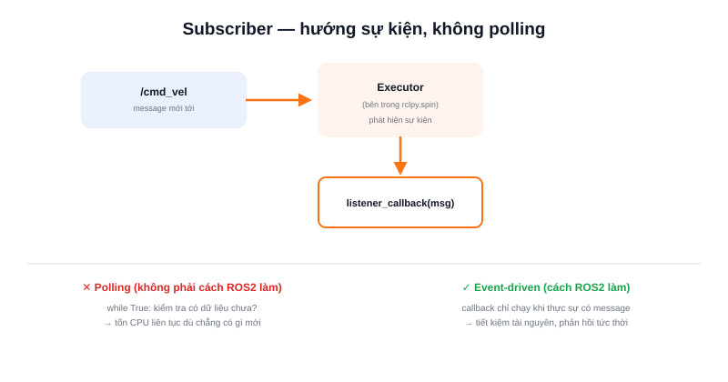

Nếu Publisher là bên "nói", **Subscriber** là bên "nghe" — một node muốn nhận dữ liệu từ một topic (dữ liệu LiDAR, lệnh điều khiển, trạng thái pin...) sẽ tạo một Subscriber gắn với topic và kiểu message tương ứng.



## Khái niệm chính

Điểm khác biệt quan trọng nhất của Subscriber so với việc "hỏi dữ liệu thủ công": nó hoạt động theo mô hình **hướng sự kiện (event-driven)**. Khi tạo subscriber, node đăng ký kèm một **hàm callback** — hàm này **tự động được gọi** mỗi khi có message mới tới trên topic đó, node không cần chủ động kiểm tra ("có dữ liệu chưa? có dữ liệu chưa?") theo kiểu polling tốn tài nguyên.

Việc callback được gọi đúng lúc là nhiệm vụ của **executor** — cơ chế bên trong `rclpy.spin()` liên tục theo dõi mọi subscriber/timer/service của node và gọi đúng hàm xử lý tương ứng khi sự kiện xảy ra.

> **Tóm lại:** Không cần vòng lặp `while True: kiểm_tra_dữ_liệu()` thủ công — chỉ cần định nghĩa callback đúng logic xử lý, `rclpy.spin()` sẽ tự lo phần "khi nào gọi nó".

## Nguyên lý hoạt động

Subscriber tối thiểu, in ra vận tốc mỗi khi nhận được message mới trên `/cmd_vel`:

```python
import rclpy
from rclpy.node import Node
from geometry_msgs.msg import Twist

class VelocitySubscriber(Node):
    def __init__(self):
        super().__init__('velocity_subscriber')
        self.subscription = self.create_subscription(
            Twist, '/cmd_vel', self.listener_callback, 10)

    def listener_callback(self, msg):
        # Hàm này TỰ ĐỘNG được gọi mỗi khi có message mới — không cần vòng lặp thủ công
        self.get_logger().info(f'Nhận được: linear.x = {msg.linear.x}')

def main():
    rclpy.init()
    node = VelocitySubscriber()
    rclpy.spin(node)   # giữ node sống, executor gọi listener_callback khi có dữ liệu
    rclpy.shutdown()
```

```text
Message mới tới trên /cmd_vel
         ↓
   executor phát hiện
         ↓
   gọi listener_callback(msg)
         ↓
   code xử lý bên trong callback chạy
```

Một lưu ý quan trọng khi viết callback: **không nên đặt code chạy lâu (vòng lặp nặng, `sleep()` dài) bên trong callback** — vì executor thường xử lý callback tuần tự trên cùng một luồng, một callback chạy lâu sẽ chặn luôn việc xử lý các sự kiện khác của node (timer, subscriber khác) cho tới khi nó chạy xong.
