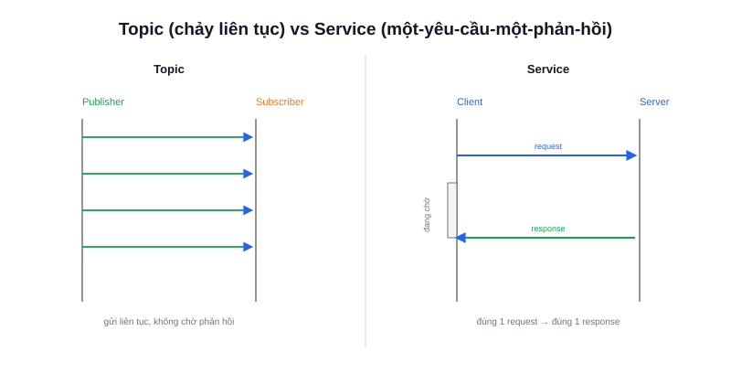

"Reset lại giá trị encoder về 0", "lưu bản đồ hiện tại ra file" — đây là những yêu cầu chỉ cần thực hiện **một lần**, có kết quả rõ ràng ngay sau đó, không phải luồng dữ liệu liên tục. **Service** là cơ chế ROS2 dành cho đúng kiểu tương tác này.



## Khái niệm chính

Service hoạt động theo mô hình **request-response** kinh điển, gồm hai phía:

- **Service Server** — "đăng ký" cung cấp một dịch vụ có tên cụ thể, chờ nhận yêu cầu và trả về kết quả
- **Service Client** — gửi một yêu cầu (request) tới server, **chờ nhận đúng một phản hồi (response)** rồi mới tiếp tục

Khác với Topic (publisher không biết ai nhận, không có gì đảm bảo), Service luôn có **đúng một cặp yêu cầu – phản hồi** cho mỗi lần gọi — giống hệt việc gọi một hàm (function call) thông thường, chỉ khác là hàm đó chạy trên một tiến trình (node) khác.

> **Tóm lại:** Topic phù hợp cho dữ liệu chảy liên tục không cần xác nhận; Service phù hợp cho một hành động rời rạc cần biết chắc chắn kết quả — như bật/tắt một chế độ, hay thực hiện một phép tính theo yêu cầu.

## Nguyên lý hoạt động

```text
Service Client                    Service Server
      │  gửi request                    │
      ├─────────────────────────────────►│
      │                                   │  xử lý yêu cầu
      │           chờ...                 │
      │◄─────────────────────────────────┤
      │  nhận response                   │
```

Gọi thử một service có sẵn ngay từ dòng lệnh, không cần viết code:

```bash
ros2 service list                     # liệt kê mọi service đang hoạt động
ros2 service call /reset_encoder std_srvs/srv/Trigger
```

Ví dụ Service Server đơn giản bằng Python, cộng hai số nguyên theo yêu cầu:

```python
from example_interfaces.srv import AddTwoInts

class AddServer(Node):
    def __init__(self):
        super().__init__('add_server')
        self.srv = self.create_service(AddTwoInts, 'add_two_ints', self.add_callback)

    def add_callback(self, request, response):
        response.sum = request.a + request.b   # xử lý, gán kết quả vào response
        return response                          # trả về — client đang chờ ở đây
```

Kiểu dữ liệu request/response (như `AddTwoInts` ở trên) được định nghĩa trong file `.srv` riêng của package — chủ đề được trình bày sâu hơn ở bài Service trong mục ROS2 Communication, cùng với vấn đề quan trọng: gọi service theo kiểu đồng bộ (blocking) có thể gây "treo" node trong một số trường hợp.
