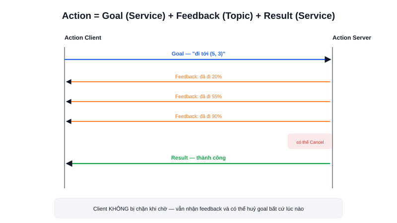

Lệnh "di chuyển robot tới toạ độ (5, 3)" không giống việc "cộng hai số" — nó có thể mất hàng chục giây, người dùng muốn biết robot đang tiến tới đâu (tiến độ), và có thể cần **huỷ giữa chừng** nếu đổi ý. Đây là bài toán mà cả Topic (không có khái niệm "hoàn thành") lẫn Service (chỉ trả về một kết quả duy nhất, không báo tiến độ, và block trong lúc chờ) đều xử lý không gọn — **Action** sinh ra để giải quyết đúng vấn đề này.



## Khái niệm chính

Action kết hợp cả ba khái niệm đã học trước đó thành một cơ chế thống nhất:

- **Goal** — mục tiêu gửi đi lúc bắt đầu (giống gửi request của Service), ví dụ "di chuyển tới toạ độ (5, 3)"
- **Feedback** — dữ liệu tiến độ được gửi liên tục trong lúc tác vụ đang chạy (giống một Topic), ví dụ "đã đi được 40%, còn cách đích 3m"
- **Result** — kết quả cuối cùng khi tác vụ hoàn tất, thất bại, hoặc bị huỷ (giống response của Service)

Khác với Service (client bị block chờ tới khi có response), client của Action gửi goal xong **không bị chặn** — nó tiếp tục nhận feedback dồn dập trong lúc goal đang thực thi, và có quyền **huỷ (cancel)** goal đang chạy bất cứ lúc nào nếu cần.

> **Tóm lại:** Dùng Topic cho dữ liệu chảy liên tục · Service cho một hành động ngắn có kết quả tức thì · Action cho tác vụ dài, cần theo dõi tiến độ và có khả năng huỷ giữa chừng — đây chính xác là cơ chế Nav2 dùng để nhận lệnh "di chuyển tới một điểm" từ RViz hoặc code.

## Nguyên lý hoạt động

```text
Action Client                         Action Server
      │  gửi Goal ("đi tới (5,3)")           │
      ├──────────────────────────────────────►│  bắt đầu thực thi
      │                                        │
      │◄──────────── Feedback (20%) ───────────┤
      │◄──────────── Feedback (55%) ───────────┤
      │◄──────────── Feedback (90%) ───────────┤
      │                                        │
      │◄──────────── Result (thành công) ──────┤
```

Gọi thử một action có sẵn từ dòng lệnh, quan sát feedback trực tiếp trên terminal:

```bash
ros2 action list                                   # liệt kê action đang hoạt động
ros2 action send_goal /navigate_to_pose nav2_msgs/action/NavigateToPose \
  "{pose: {pose: {position: {x: 5.0, y: 3.0}}}}" --feedback
```

Cờ `--feedback` khiến terminal in liên tục mọi bản tin tiến độ nhận được cho tới khi action hoàn tất — đúng luồng goal → feedback → result vừa mô tả ở trên. Cách một action server quản lý trạng thái nội bộ (đang chờ, đang chạy, bị huỷ, thành công...) và cách action thực chất được ghép từ Service + Topic bên dưới sẽ được trình bày sâu hơn ở bài Action trong mục ROS2 Communication.
