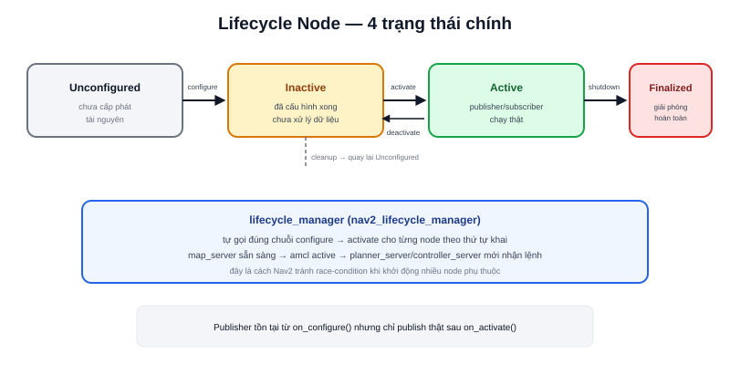

Một node C++/Python thông thường (`rclcpp::Node`) chạy logic ngay trong constructor — không có cách nào chuẩn để "khai báo xong nhưng chưa chạy". Với hệ thống nhiều node phụ thuộc lẫn nhau như Nav2 (`amcl` phải sẵn sàng trước khi `planner_server` bắt đầu nhận lệnh), điều này gây ra tình trạng khởi động không đồng bộ. **Lifecycle Node** (`rclcpp_lifecycle::LifecycleNode`) giải quyết vấn đề này bằng một máy trạng thái (state machine) rõ ràng.



## 4 trạng thái chính

- **Unconfigured** — vừa tạo, chưa cấp phát tài nguyên (chưa mở port, chưa đọc file config)
- **Inactive** — đã cấu hình xong (đã cấp phát tài nguyên) nhưng **chưa xử lý dữ liệu** — publisher tồn tại nhưng chưa publish, subscriber chưa nhận callback
- **Active** — hoạt động đầy đủ, publisher/subscriber/timer đều chạy thật
- **Finalized** — trạng thái cuối, đã giải phóng toàn bộ tài nguyên, không quay lại được

Chuyển giữa các trạng thái qua **transition** (`configure`, `activate`, `deactivate`, `cleanup`, `shutdown`) — mỗi transition tương ứng một callback bạn override trong code:

```cpp
class MotorLifecycleNode : public rclcpp_lifecycle::LifecycleNode {
public:
  MotorLifecycleNode() : LifecycleNode("motor_node") {}

  CallbackReturn on_configure(const rclcpp_lifecycle::State &) override {
    pub_ = create_publisher<std_msgs::msg::Float32>("motor_status", 10);
    return CallbackReturn::SUCCESS;
  }

  CallbackReturn on_activate(const rclcpp_lifecycle::State &) override {
    pub_->on_activate();   // publisher chỉ thực sự publish sau bước này
    return CallbackReturn::SUCCESS;
  }

private:
  std::shared_ptr<rclcpp_lifecycle::LifecyclePublisher<std_msgs::msg::Float32>> pub_;
};
```

> **Tóm lại:** Khác biệt cốt lõi so với node thường: publisher của Lifecycle Node **tồn tại** ngay từ `on_configure()` nhưng chỉ **thực sự gửi dữ liệu** sau `on_activate()` — cho phép hệ thống bên ngoài kiểm soát chính xác thời điểm node bắt đầu ảnh hưởng tới phần còn lại, thay vì "cứ tạo xong là chạy" như node thường.

## lifecycle_manager — điều phối nhiều node cùng lúc

Đây chính xác là cơ chế Nav2 dùng để đảm bảo `map_server` sẵn sàng trước khi `amcl` active, `amcl` active trước khi `planner_server`/`controller_server` bắt đầu nhận lệnh:

```bash
ros2 lifecycle set /motor_node configure
ros2 lifecycle set /motor_node activate
ros2 lifecycle get /motor_node    # xem trạng thái hiện tại
```

`lifecycle_manager` (package `nav2_lifecycle_manager`) tự động hoá đúng chuỗi lệnh này cho một danh sách node theo thứ tự khai báo, thay vì bạn phải gọi tay từng `ros2 lifecycle set` — đây là lý do Nav2 luôn khởi động đúng thứ tự dù có hàng chục node phụ thuộc lẫn nhau.

## Khi nào nên dùng Lifecycle Node

Không phải node nào cũng cần — chi phí thêm state machine chỉ đáng khi node đó:

- Cần cấp phát tài nguyên tốn kém (mở kết nối phần cứng, load model AI) mà muốn tách riêng khỏi thời điểm bắt đầu xử lý
- Là một phần của hệ thống nhiều node phụ thuộc thứ tự khởi động chặt chẽ (như Nav2)
- Cần khả năng "tạm dừng" (deactivate) mà không mất trạng thái đã cấu hình, rồi "bật lại" (activate) nhanh hơn khởi động lại từ đầu
