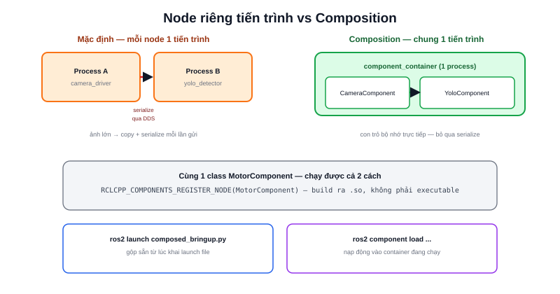

Mặc định, mỗi lần `ros2 run` là một tiến trình hệ điều hành riêng — hai node trao đổi dữ liệu qua nhau vẫn phải đi qua toàn bộ đường DDS: serialize message, gửi qua socket/loopback, deserialize lại. Với message nhỏ (Twist, Odometry) chi phí này không đáng kể, nhưng với ảnh camera độ phân giải cao publish ở tần số cao, việc serialize/copy liên tục trở thành nút thắt cổ chai thực sự. **Composition** cho phép gộp nhiều node vào chung một tiến trình, giao tiếp bằng con trỏ bộ nhớ thay vì message qua DDS.



## Component node — viết một lần, chạy được cả hai cách

Khác biệt so với node thường: đăng ký node như một **plugin** qua `class_loader`, cho phép cùng một class chạy độc lập (`ros2 run`) hoặc load chung tiến trình (composition) mà không cần sửa code:

```cpp
// motor_component.cpp
#include "rclcpp_components/register_node_macro.hpp"

class MotorComponent : public rclcpp::Node {
public:
  explicit MotorComponent(const rclcpp::NodeOptions & options)
  : Node("motor_component", options) { /* ... */ }
};

RCLCPP_COMPONENTS_REGISTER_NODE(MotorComponent)
```

```cmake
# CMakeLists.txt
add_library(motor_component SHARED src/motor_component.cpp)
ament_target_dependencies(motor_component rclcpp rclcpp_components)
rclcpp_components_register_nodes(motor_component "MotorComponent")
```

Điểm khác biệt mấu chốt: build ra **thư viện chia sẻ (`.so`)**, không phải executable độc lập — một component có thể được nạp vào bất kỳ tiến trình composition nào tại thời điểm chạy.

## Hai cách load component

```bash
# Cách 1: gộp sẵn nhiều component vào 1 tiến trình từ launch file
ros2 launch my_pkg composed_bringup.launch.py

# Cách 2: load động vào 1 container đang chạy sẵn
ros2 run rclcpp_components component_container &
ros2 component load /ComponentManager my_pkg MotorComponent
ros2 component list
```

`component_container` là một tiến trình "vỏ rỗng" chờ sẵn, `ros2 component load` nạp thêm component vào lúc runtime — hữu ích khi muốn thêm/bớt node đang chạy mà không restart cả hệ thống.

> **Tóm lại:** Composition không thay đổi logic bên trong node — nó thay đổi **nơi** node chạy (chung hay riêng tiến trình) và **cách** dữ liệu di chuyển giữa các node (qua DDS hay qua con trỏ bộ nhớ trực tiếp). Lợi ích lớn nhất là intra-process communication: publisher và subscriber trong cùng tiến trình có thể chuyển message bằng con trỏ, bỏ qua toàn bộ bước serialize.

## Khi nào đáng dùng

| Tình huống | Nên dùng Composition? |
|---|---|
| Camera driver → node xử lý ảnh (OpenCV/YOLO) tần số cao | Có — tiết kiệm serialize ảnh lớn liên tục |
| Vài node điều khiển tốc độ thấp (Twist, trạng thái) | Không cần thiết — chi phí DDS với message nhỏ không đáng kể |
| Cần cách ly lỗi — 1 node crash không kéo sập node khác | Không — cùng tiến trình nghĩa là 1 node crash sập cả nhóm |
