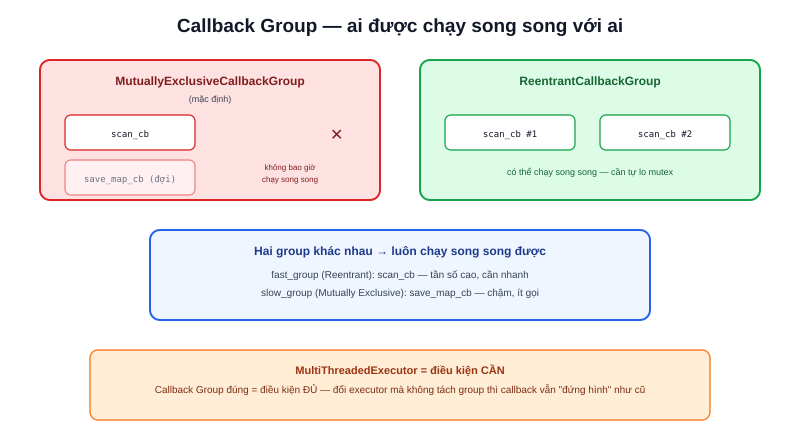

Mặc định, mọi callback (subscriber, timer, service) trong một node ROS2 thuộc cùng một nhóm gọi là **MutuallyExclusiveCallbackGroup** — nghĩa là chúng **không bao giờ chạy đồng thời**, kể cả khi node dùng `MultiThreadedExecutor` (xem bài Multi-threading) với nhiều luồng sẵn sàng. Một callback service xử lý chậm (đọc file lớn, gọi API mạng) sẽ chặn đứng callback đọc cảm biến khác của cùng node cho tới khi xong — dù về mặt lý thuyết có đủ luồng để chạy song song.



## Hai loại Callback Group

- **MutuallyExclusiveCallbackGroup** (mặc định) — các callback trong cùng group đảm bảo không bao giờ chạy đồng thời, kể cả có nhiều thread rảnh. An toàn tuyệt đối với dữ liệu chia sẻ (không cần lock), nhưng dễ bị một callback chậm chặn callback khác
- **ReentrantCallbackGroup** — các callback trong cùng group **được phép** chạy song song với nhau (kể cả nhiều instance của cùng một callback đang chạy cùng lúc), miễn là executor có đủ thread. Cần tự đảm bảo an toàn dữ liệu chia sẻ (mutex) vì giờ có thể có race condition

```python
from rclpy.callback_groups import MutuallyExclusiveCallbackGroup, ReentrantCallbackGroup

class MyNode(Node):
    def __init__(self):
        super().__init__("my_node")
        fast_group = ReentrantCallbackGroup()
        slow_group = MutuallyExclusiveCallbackGroup()

        self.create_subscription(LaserScan, "/scan", self.scan_cb, 10,
                                  callback_group=fast_group)
        self.create_service(Trigger, "/save_map", self.save_map_cb,
                             callback_group=slow_group)
```

Cấu hình trên tách hẳn hai luồng xử lý: `scan_cb` (đọc cảm biến, cần phản hồi nhanh, tần số cao) nằm trong `ReentrantCallbackGroup` riêng, không bao giờ bị `save_map_cb` (chậm, ít gọi) chặn lại — vì chúng thuộc hai group khác nhau.

> **Tóm lại:** Callback trong **cùng một group** không bao giờ chạy song song nếu là Mutually Exclusive, hoặc có thể chạy song song nếu là Reentrant. Callback ở **hai group khác nhau** luôn có thể chạy song song với nhau (nếu executor đủ thread), bất kể loại group nào. Muốn tách một callback chậm ra khỏi đường đi của callback nhanh — cách làm là đặt chúng vào group khác nhau, không phải đổi loại executor.

## Sai lầm thường gặp: đổi Executor mà quên Callback Group

Nhiều người gặp callback bị "đứng hình" nghĩ do executor đơn luồng, chuyển sang `MultiThreadedExecutor` (xem bài riêng) nhưng vẫn thấy hiện tượng cũ — lý do: **mặc định mọi callback vẫn nằm chung một MutuallyExclusiveCallbackGroup**, đổi executor không tự động cho phép chúng chạy song song. Phải chủ động tách callback cần song song ra callback_group riêng, `MultiThreadedExecutor` chỉ là điều kiện cần (có đủ thread để chạy song song), Callback Group phù hợp mới là điều kiện đủ.
