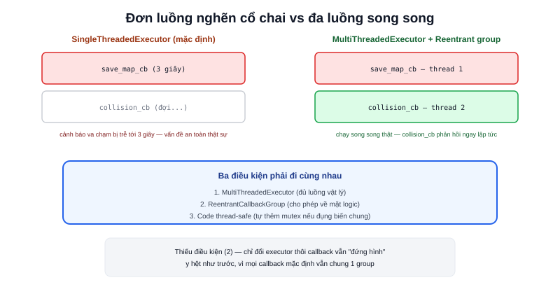

Người mới thường nghĩ multi-threading trong ROS2 là để tăng tốc độ xử lý, giống lập trình đa luồng thông thường. Thực ra vấn đề nó giải quyết hẹp và cụ thể hơn nhiều: **một node có nhiều callback (subscriber, service, timer), mặc định chạy tuần tự trên một luồng duy nhất** — nếu một callback bị chậm (đọc file, gọi service khác, tính toán nặng), toàn bộ callback còn lại của node đó phải xếp hàng chờ, kể cả những callback cần phản hồi tức thì như đọc cảm biến an toàn.



## SingleThreadedExecutor — mặc định, và vì sao dễ nghẽn

```python
rclpy.spin(node)   # thực chất dùng SingleThreadedExecutor bên trong
```

Mọi callback của `node` — dù đăng ký ở subscriber, timer, hay service khác nhau — đều được xếp vào một hàng đợi, xử lý **tuần tự từng cái một** trên đúng một luồng. Callback service `save_map` mất 3 giây để ghi file sẽ khiến callback đọc cảm biến va chạm (cần phản hồi tức thì để dừng khẩn cấp) phải đợi đủ 3 giây đó mới được xử lý — một vấn đề an toàn thực sự, không chỉ là hiệu năng.

## MultiThreadedExecutor — cho phép chạy song song, có điều kiện

```python
from rclpy.executors import MultiThreadedExecutor

executor = MultiThreadedExecutor(num_threads=4)
executor.add_node(node)
executor.spin()
```

`num_threads=4` cấp 4 luồng cho executor phân phối callback. Nhưng chỉ đổi executor thôi **chưa đủ** — như bài [Callback Group](/blog/callback-group) đã giải thích, mặc định mọi callback vẫn nằm chung một `MutuallyExclusiveCallbackGroup`, tự động không cho phép chạy song song dù có bao nhiêu luồng rảnh. Phải cố tình tách callback cần song song sang `ReentrantCallbackGroup` riêng thì việc thêm luồng mới thực sự có tác dụng.

> **Tóm lại:** Ba khái niệm phải đi cùng nhau mới giải quyết được vấn đề "callback chậm chặn callback nhanh": **MultiThreadedExecutor** (có đủ luồng vật lý để chạy song song) + **Callback Group phù hợp** (cho phép về mặt logic) + node code phải **thread-safe** (nếu nhiều callback cùng đụng vào biến chung, cần mutex tự quản lý — ROS2 không tự lo phần này).

## Nhiều node, một tiến trình: add_node vào chung một executor

```python
executor = MultiThreadedExecutor()
executor.add_node(motor_node)
executor.add_node(lidar_node)
executor.spin()
```

Một executor không giới hạn quản lý đúng một node — `add_node()` nhiều lần cho phép nhiều node chia sẻ chung một pool luồng, thay vì mỗi node tự `rclpy.spin()` riêng (tốn thêm luồng OS cho mỗi lần spin độc lập). Đây cũng là nền tảng kỹ thuật bên dưới của Composition (xem bài riêng) — nhiều component chạy chung tiến trình thường dùng chung một executor kiểu này.

## Bảng quyết định nhanh

| Tình huống | Giải pháp |
|---|---|
| Node chỉ có 1-2 callback đơn giản, không callback nào chậm | SingleThreadedExecutor (mặc định) là đủ |
| Có callback chậm (I/O, tính toán nặng) cần tách khỏi callback nhanh | MultiThreadedExecutor + ReentrantCallbackGroup cho callback nhanh |
| Nhiều node cần chia sẻ tài nguyên tính toán, giảm overhead luồng | MultiThreadedExecutor + add_node() nhiều lần |
| Callback đụng chung biến/state — nhiều callback cùng ghi | Vẫn cần tự thêm `threading.Lock()` dù dùng executor nào |
