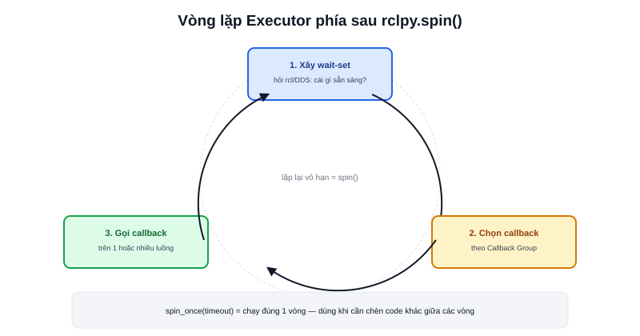

Gần như mọi node ROS2 kết thúc bằng `rclpy.spin(node)`, nhưng ít ai để ý dòng này thực chất tạo và chạy một **Executor** ẩn bên dưới. Hiểu đúng Executor là gì giải thích được cả hai bài trước — vì sao callback mặc định chạy tuần tự (Multi-threading), và vì sao Callback Group kiểm soát được việc song song.



## Executor là gì

Executor là vòng lặp (event loop) làm đúng ba việc lặp đi lặp lại:

1. **Xây wait-set** — hỏi lớp `rcl`/DDS bên dưới: trong số các subscriber/timer/service/action đã đăng ký với node, cái nào đang **có dữ liệu sẵn sàng** để xử lý ngay bây giờ?
2. **Chọn callback sẵn sàng** — từ danh sách trên, chọn ra các callback đủ điều kiện chạy (còn phụ thuộc Callback Group của từng cái — xem bài riêng)
3. **Gọi callback** — thực thi hàm callback tương ứng, trên luồng nào tuỳ loại Executor (Single hay MultiThreaded)

```python
import rclpy
rclpy.init()
node = rclpy.create_node("my_node")
rclpy.spin(node)   # tạo SingleThreadedExecutor, add_node(), rồi spin() vô hạn
```

`rclpy.spin(node)` chỉ là hàm tiện ích gói gọn 3 dòng: tạo executor mặc định, `add_node(node)`, gọi `executor.spin()` — viết tường minh ba bước này ra là cách duy nhất để tự chọn loại executor khác (`MultiThreadedExecutor`) thay vì mặc định.

## spin() vs spin_once()

```python
executor = rclpy.executors.SingleThreadedExecutor()
executor.add_node(node)

while rclpy.ok():
    executor.spin_once(timeout_sec=0.1)   # xử lý đúng 1 vòng rồi trả quyền điều khiển
    # có thể chèn code khác ở đây giữa các vòng
```

`spin()` chạy vô hạn cho tới khi node bị shutdown — phù hợp phần lớn trường hợp. `spin_once()` chỉ xử lý một lượt rồi trả lại quyền điều khiển cho vòng lặp `while` của bạn — dùng khi cần chèn logic tuỳ biến giữa các lượt xử lý callback (ví dụ tích hợp ROS2 vào một game loop hoặc GUI framework đã có vòng lặp riêng, không thể nhường hoàn toàn quyền điều khiển cho `spin()`).

> **Tóm lại:** Executor là lớp trung gian giữa "dữ liệu đã tới từ DDS" và "code callback của bạn thực sự chạy" — nó quyết định thứ tự và mức độ song song, không phải DDS hay rclpy tự làm việc đó.

## StaticSingleThreadedExecutor — tối ưu cho trường hợp cấu hình cố định

```python
executor = rclpy.executors.StaticSingleThreadedExecutor()
```

Bản `SingleThreadedExecutor` thường xây lại wait-set từ đầu mỗi vòng lặp — có chi phí nếu số lượng subscriber/timer lớn. `StaticSingleThreadedExecutor` xây wait-set **một lần duy nhất** lúc khởi tạo, giả định tập hợp entity (subscriber, timer...) của node không đổi trong suốt vòng đời — đánh đổi tính linh hoạt (không hỗ trợ tốt việc thêm/bớt subscriber lúc runtime) lấy hiệu năng cao hơn, phù hợp node có cấu hình callback cố định ngay từ lúc khởi tạo và không đổi (phổ biến ở robot thực tế, ít phổ biến khi đang phát triển/thử nghiệm).
