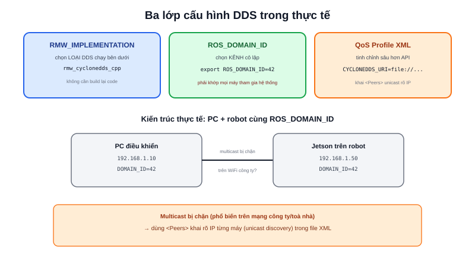

Bài [DDS là gì?](/blog/dds) đã giải thích RMW là lớp trừu tượng cho phép đổi triển khai DDS bên dưới. Bài này đi vào các biến môi trường và file cấu hình dùng thực tế khi triển khai robot nhiều máy — đúng tình huống một PC điều khiển và một máy tính nhúng trên robot (như kiến trúc Jetson Orin Nano + PC trong dự án Atlas A2) phải cùng nhìn thấy nhau qua mạng.



## Đổi triển khai DDS

```bash
echo $RMW_IMPLEMENTATION
export RMW_IMPLEMENTATION=rmw_cyclonedds_cpp   # đổi từ Fast DDS (mặc định) sang Cyclone DDS
```

Đổi triển khai không cần build lại code — vì code ứng dụng chỉ gọi qua `rclpy`/`rclcpp`, không bao giờ gọi thẳng API của DDS cụ thể. Lý do hay cần đổi trong thực tế: Cyclone DDS thường ổn định hơn trên mạng WiFi không đáng tin cậy (robot di động), trong khi Fast DDS là mặc định và có cộng đồng lớn hơn khi cần tra cứu lỗi.

## Cô lập nhiều robot cùng mạng bằng ROS_DOMAIN_ID

```bash
export ROS_DOMAIN_ID=42
```

Mỗi domain ID là một "kênh" DDS độc lập — node ở domain 42 không thấy node ở domain 0, dù chạy chung một mạng WiFi vật lý. Bắt buộc **mọi máy tham gia cùng một hệ thống robot phải đặt cùng một domain ID** (PC điều khiển và máy tính nhúng trên robot, ví dụ) — quên đồng bộ giá trị này là nguyên nhân phổ biến nhất của lỗi "topic list rỗng dù node rõ ràng đang chạy trên máy kia".

```bash
export ROS_LOCALHOST_ONLY=1
```

Biến này giới hạn discovery chỉ trong `localhost` — hữu ích khi chạy nhiều instance ROS2 test độc lập trên cùng một máy (ví dụ mô phỏng Gazebo cùng lúc với robot thật kết nối cùng mạng) mà không muốn chúng vô tình nhìn thấy nhau.

> **Tóm lại:** `RMW_IMPLEMENTATION` chọn *loại* DDS chạy bên dưới, `ROS_DOMAIN_ID` chọn *kênh* cô lập giữa các nhóm node — hai biến độc lập nhau, cả hai đều phải khớp giữa các máy tham gia cùng hệ thống mới giao tiếp được.

## QoS Profile XML — khi API mặc định không đủ

Với phần lớn trường hợp, cấu hình QoS qua code (`rclpy.qos.QoSProfile`, xem bài QoS) là đủ. Khi cần tinh chỉnh sâu hơn mức API ROS2 cho phép — ví dụ giới hạn danh sách địa chỉ IP tham gia discovery thay vì multicast toàn mạng — dùng file XML riêng của từng triển khai DDS:

```xml
<!-- cyclonedds_config.xml -->
<CycloneDDS>
  <Domain>
    <General>
      <NetworkInterfaceAddress>192.168.1.50</NetworkInterfaceAddress>
    </General>
    <Discovery>
      <Peers>
        <Peer Address="192.168.1.10"/>   <!-- PC điều khiển -->
        <Peer Address="192.168.1.50"/>   <!-- Jetson trên robot -->
      </Discovery>
    </Domain>
  </CycloneDDS>
</CycloneDDS>
```

```bash
export CYCLONEDDS_URI=file:///path/to/cyclonedds_config.xml
```

Khai `<Peers>` tường minh (unicast discovery) thay vì để mặc định multicast hữu ích trên mạng WiFi doanh nghiệp/nhà thường **chặn multicast** vì lý do bảo mật — không có multicast, hai máy dù cùng `ROS_DOMAIN_ID` cũng không tự tìm thấy nhau, và đây chính là nguyên nhân của không ít lỗi "DDS không thấy topic cross-machine" từng gặp trong thực tế triển khai robot ở môi trường mạng công ty/toà nhà, khác hẳn mạng WiFi cá nhân mở multicast tự do.
