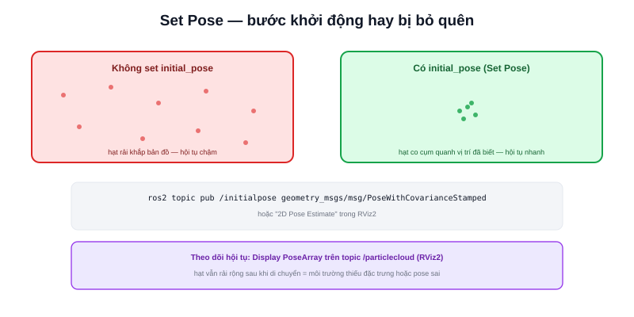

Bài [AMCL là gì?](/blog/amcl-la-gi) (chuyên mục Robotics Fundamentals) đã giải thích particle filter ở mức lý thuyết. Bài này là phần thực hành trong hệ sinh thái Nav2: node `amcl` thực tế cấu hình ra sao, và một bước hay bị bỏ quên — "Set Pose" khi khởi động.



## Tham số cấu hình chính

```yaml
amcl:
  ros__parameters:
    min_particles: 500
    max_particles: 2000
    initial_pose: {x: 0.0, y: 0.0, yaw: 0.0}
    laser_max_range: 12.0
    update_min_d: 0.2      # chỉ update khi robot di chuyển đủ 0.2m
    update_min_a: 0.2      # hoặc xoay đủ 0.2 rad
```

- **`min_particles`/`max_particles`** — biên dưới/trên của kỹ thuật KLD-sampling đã học ở bài AMCL là gì? — càng rộng khoảng này, AMCL càng linh hoạt điều chỉnh tải tính toán theo độ bất định thực tế
- **`update_min_d`/`update_min_a`** — ngưỡng chuyển động tối thiểu trước khi chạy lại bước Update — tránh lãng phí tính toán khi robot gần như đứng yên, không có gì mới để cập nhật

## Set Pose — bước khởi động hay bị bỏ quên

AMCL không tự động biết robot đang ở đâu khi mới khởi động — nếu không cung cấp `initial_pose`, các hạt (particle) mặc định rải ngẫu nhiên khắp bản đồ, mất nhiều thời gian hội tụ hơn nhiều (hoặc không hội tụ đúng nếu môi trường có nhiều vùng đối xứng gây nhầm lẫn — đúng vấn đề "đa giả thuyết" đã nhắc ở bài AMCL là gì?).

```bash
ros2 topic pub /initialpose geometry_msgs/msg/PoseWithCovarianceStamped \
  "{pose: {pose: {position: {x: 1.0, y: 2.0}}}}"
```

> **Tóm lại:** Luôn cung cấp vị trí khởi tạo gần đúng (qua tham số `initial_pose` hoặc "2D Pose Estimate" trong RViz2) thay vì để AMCL tự đoán từ đầu — tiết kiệm thời gian hội tụ đáng kể, và tránh trường hợp AMCL hội tụ nhầm vào một vị trí đối xứng sai trong bản đồ có bố cục lặp lại (nhiều phòng giống hệt nhau, ví dụ).

## Theo dõi độ hội tụ qua RViz2

Đã học ở bài [RViz2](/blog/rviz2): thêm Display `PoseArray` cho topic `/particlecloud` — đám mây hạt co cụm chặt lại quanh một vị trí là dấu hiệu AMCL đã hội tụ tốt; nếu hạt vẫn rải rác rộng sau một thời gian di chuyển, có thể là dấu hiệu môi trường thiếu đặc trưng hình học rõ ràng (đúng vấn đề đã nhắc ở bài [LiDAR SLAM](/blog/lidar-slam)) hoặc `initial_pose` sai quá xa vị trí thật.

## Lifecycle Node — AMCL cũng cần configure/activate

Đúng như đã học ở bài [Lifecycle Node](/blog/lifecycle-node), `amcl` là một managed node — `lifecycle_manager` của Nav2 gọi `configure` rồi `activate` theo đúng thứ tự trước khi node khác (như `controller_server`) bắt đầu dùng dữ liệu định vị từ nó, đảm bảo không có node nào nhận dữ liệu vị trí từ một AMCL chưa sẵn sàng.
