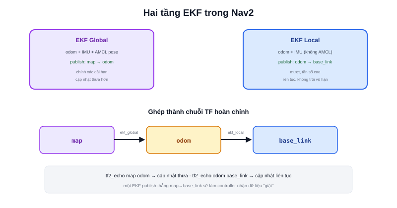

Bài [EKF](/blog/ekf-extended-kalman-filter) (chuyên mục Robotics Fundamentals) đã giải thích thuật toán predict-update tổng quát. Trong kiến trúc Nav2 thực tế, package `robot_localization` thường được triển khai theo một pattern cụ thể: **hai EKF riêng biệt**, mỗi cái phụ trách đúng một đoạn trong TF tree đã học ở bài [Hệ toạ độ trong Robot](/blog/he-toa-do-trong-robot).



## EKF cục bộ (Local) — chỉ fusion odometry + IMU

```yaml
ekf_local:
  ros__parameters:
    frequency: 30.0
    odom0: /wheel_odom
    imu0: /imu/data
    world_frame: odom
    publish_tf: true    # publish transform odom → base_link
```

EKF này **không** nhận dữ liệu từ AMCL — chỉ kết hợp odometry bánh xe và IMU (đúng bài [Sensor Fusion](/blog/sensor-fusion-la-gi)), publish transform `odom → base_link`. Đặc điểm: **mượt, tần số cao, liên tục** — nhưng vẫn trôi dần theo thời gian vì không có nguồn tuyệt đối nào hiệu chỉnh.

## EKF toàn cục (Global) — thêm cả AMCL

```yaml
ekf_global:
  ros__parameters:
    frequency: 30.0
    odom0: /wheel_odom
    imu0: /imu/data
    pose0: /amcl_pose      # thêm nguồn AMCL
    world_frame: map
    publish_tf: true       # publish transform map → odom
```

EKF thứ hai nhận thêm **pose từ AMCL** làm nguồn "neo" tuyệt đối, publish transform `map → odom` — đúng đoạn transform "cập nhật thưa hơn, hiệu chỉnh định kỳ" đã nói ở bài [Hệ toạ độ trong Robot](/blog/he-toa-do-trong-robot) và [Odometry trong Localization](/blog/odometry-trong-localization).

> **Tóm lại:** Hai EKF không dư thừa nhau — mỗi cái publish đúng một đoạn TF khác nhau (`odom→base_link` vs `map→odom`), ghép lại đúng chuỗi `map → odom → base_link` hoàn chỉnh. Tầng local đảm bảo dữ liệu mượt, tần số cao cho các node cần phản hồi nhanh (như [controller_server](/blog/controller)); tầng global đảm bảo vị trí tuyệt đối không trôi vô hạn, cho các node cần độ chính xác dài hạn (như [planner_server](/blog/planner)).

## Vì sao không dùng một EKF duy nhất cho cả map và odom

Nếu chỉ dùng một EKF publish thẳng `map → base_link`, các node cần dữ liệu mượt tần số cao (như controller bám path) sẽ nhận dữ liệu "giật" mỗi khi AMCL cập nhật thưa thớt — đúng vấn đề "robot giật mỗi khi AMCL hiệu chỉnh lại" đã nhắc ở bài Hệ toạ độ. Tách 2 tầng cho phép mỗi loại dữ liệu (mượt tần số cao vs chính xác dài hạn) tồn tại độc lập trong đúng đoạn TF của nó, không xung đột nhau.

## Debug: kiểm tra TF publish đúng đoạn

```bash
ros2 run tf2_ros tf2_echo map odom       # nên thấy cập nhật thưa, từ ekf_global
ros2 run tf2_ros tf2_echo odom base_link  # nên thấy cập nhật liên tục, từ ekf_local
```

Nếu một trong hai lệnh trên không trả về dữ liệu, kiểm tra lại `publish_tf: true` và `world_frame` đã cấu hình đúng cho từng instance EKF chưa — nhầm lẫn cấu hình giữa hai instance là lỗi phổ biến nhất khi mới triển khai pattern 2 tầng này.
