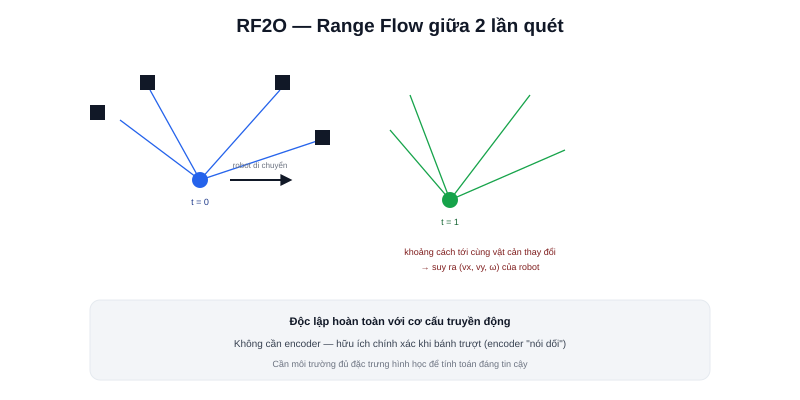

Bài [Odometry trong Localization](/blog/odometry-trong-localization) giả định nguồn dữ liệu là encoder bánh xe. **RF2O (Range Flow-based 2D Odometry)** là một nguồn odometry khác hẳn — ước lượng chuyển động robot trực tiếp từ hai lần quét LiDAR liên tiếp, không cần đọc một xung encoder nào.



## Nguyên lý: "range flow" — dòng chảy khoảng cách

Ý tưởng gần với **optical flow** trong thị giác máy tính (theo dõi pixel di chuyển giữa 2 khung hình liên tiếp để suy ra chuyển động camera) — nhưng áp dụng cho dữ liệu khoảng cách LiDAR thay vì pixel ảnh:

```text
Giữa 2 lần quét liên tiếp, mỗi tia laser đo được khoảng cách hơi khác đi
    → sự thay đổi khoảng cách đó ("range flow") tương quan trực tiếp với
      chuyển động thực tế của robot giữa 2 lần quét
```

RF2O giải một hệ phương trình tối ưu tìm vận tốc `(vx, vy, ω)` khớp nhất với toàn bộ pattern thay đổi khoảng cách quan sát được trên mọi tia laser — về bản chất là một dạng scan matching (đã học ở bài [LiDAR SLAM](/blog/lidar-slam)) nhưng tối ưu riêng cho việc ước lượng **vận tốc tức thời**, không phải để dựng bản đồ.

## Khi nào RF2O hữu ích hơn encoder

```text
Bánh xe trượt (sàn trơn, tăng/giảm tốc gấp)
    → encoder "nói dối" — đếm đủ vòng quay nhưng robot không di chuyển tương ứng
    → RF2O không quan tâm bánh xe quay bao nhiêu, chỉ nhìn LiDAR thấy gì thay đổi

Robot không có encoder (hoặc encoder hỏng/chưa lắp)
    → RF2O cung cấp odometry mà không cần thêm phần cứng nào ngoài LiDAR đã có sẵn
```

> **Tóm lại:** RF2O độc lập hoàn toàn với cơ cấu truyền động — không quan tâm robot là differential drive, mecanum, hay bất kỳ cấu hình bánh nào (khác các công thức động học riêng theo từng loại đã học ở chuyên mục Động học Robot). Đánh đổi: RF2O cần môi trường đủ đặc trưng hình học (không phải hành lang dài trống trơn, một mặt phẳng đơn điệu) để có đủ "range flow" đáng tin cậy để tính toán — đúng hạn chế đã nhắc ở bài LiDAR SLAM.

## Kết hợp RF2O với encoder qua Sensor Fusion

Không cần chọn một trong hai — RF2O có thể là một nguồn dữ liệu bổ sung trong `robot_localization` (bài [Hợp nhất Odometry](/blog/hop-nhat-odometry)) cùng với encoder và IMU, đặc biệt hữu ích ở đúng những thời điểm encoder kém tin cậy nhất (trượt bánh) mà RF2O vẫn hoạt động bình thường vì không phụ thuộc bánh xe.

## Package trong ROS2

```bash
ros2 launch rf2o_laser_odometry rf2o_laser_odometry.launch.py
```

Package `rf2o_laser_odometry` — đã xuất hiện trong kiến trúc phần mềm của dự án Diff Robot ở phần showcase của trang này — subscribe trực tiếp topic `/scan`, publish odometry ước lượng lên một topic riêng, sẵn sàng để `robot_localization` fusion cùng các nguồn khác.
