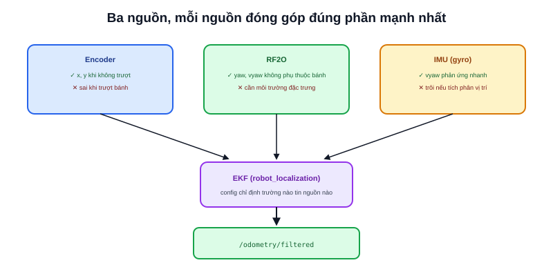

Ba nguồn ước lượng chuyển động đã giới thiệu riêng lẻ: Encoder (bài [Differential Drive](/blog/dong-hoc-robot-di-chuyen-differential-drive-odometry)), IMU (bài [Sensor Fusion](/blog/sensor-fusion-la-gi)), và RF2O (bài trước). Bài này ghép cả ba vào một cấu hình `robot_localization` thực tế — không phải chỉ 2 nguồn như ví dụ đơn giản ở bài Sensor Fusion.



## Cấu hình 3 nguồn

```yaml
ekf_local:
  ros__parameters:
    odom0: /wheel_odom
    odom0_config: [true,  true,  false,
                    false, false, false,
                    false, false, false,
                    false, false, false,
                    false, false, false]   # chỉ tin x, y từ encoder

    odom1: /rf2o/odom
    odom1_config: [false, false, false,
                    false, false, true,
                    false, false, false,
                    false, false, true,
                    false, false, false]   # tin yaw, vyaw từ RF2O

    imu0: /imu/data
    imu0_config: [false, false, false,
                   false, false, false,
                   false, false, false,
                   false, false, true,
                   false, false, false]     # tin vyaw (gyroscope) từ IMU
```

## Vì sao mỗi nguồn chỉ đóng góp đúng phần nó mạnh nhất

```text
Encoder (wheel_odom)  → chính xác cho x, y KHI KHÔNG trượt bánh
RF2O                   → chính xác cho yaw/vyaw, KHÔNG phụ thuộc trượt bánh
IMU (gyroscope)         → chính xác cho vyaw tức thời, phản ứng nhanh với thay đổi đột ngột
```

Đây là ứng dụng trực tiếp nguyên tắc đã nêu ở bài Sensor Fusion: không có nguồn nào đáng tin ở mọi khía cạnh, EKF cân trọng số động dựa trên độ không chắc chắn của từng nguồn, phần cấu hình `_config` chỉ định trước **trường dữ liệu nào** mỗi nguồn được phép đóng góp.

> **Tóm lại:** Có nhiều hơn 2 nguồn không phải để "an toàn hơn" một cách mơ hồ — mỗi nguồn thêm vào giải quyết đúng điểm mù của các nguồn còn lại. RF2O bù cho encoder khi trượt bánh; IMU bù cho cả hai khi cần phản ứng tức thời với thay đổi hướng đột ngột. Thêm nguồn không đóng góp gì mới (trùng điểm mạnh với nguồn đã có) chỉ làm hệ thống phức tạp hơn mà không cải thiện độ chính xác.

## Kiểm tra chất lượng fusion bằng cách so sánh với từng nguồn riêng

```bash
ros2 topic echo /wheel_odom      # chỉ encoder
ros2 topic echo /rf2o/odom       # chỉ RF2O
ros2 topic echo /odometry/filtered  # kết quả sau EKF
```

Khi robot đi thẳng trên sàn phẳng, ba nguồn nên cho kết quả gần khớp nhau. Khi robot đi qua đoạn sàn trơn (nghi ngờ trượt), `/wheel_odom` và `/rf2o/odom` sẽ bắt đầu lệch nhau — quan sát trực tiếp độ lệch này qua `ros2 topic echo` là cách kiểm chứng thực tế xem sensor fusion có đang hoạt động đúng như kỳ vọng, không chỉ tin vào cấu hình lý thuyết.

## Không giới hạn ở 3 nguồn

Kiến trúc `robot_localization` hỗ trợ số lượng nguồn `odom`/`imu`/`pose`/`twist` tuỳ ý (đánh số `odom0`, `odom1`, `odom2`...) — ba nguồn ở đây chỉ là ví dụ điển hình cho một AMR không GPS. Robot ngoài trời có thể thêm GPS (`pose` source), robot có camera có thể thêm visual odometry — cùng nguyên tắc, chỉ khác số lượng và loại nguồn.
