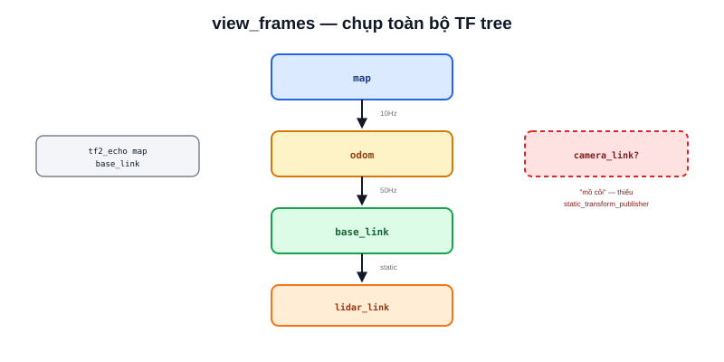

Bài [Transform](/blog/transform-va-phep-bien-doi-toa-do) giải thích TF tree về mặt lý thuyết — chuỗi các phép biến đổi nối `map → odom → base_link → lidar_link`. Bài này là phần thực hành: khi một node báo lỗi "could not transform", đây là quy trình xác định chính xác đoạn nào trong chuỗi đang thiếu hoặc sai.



## view_frames — chụp lại toàn bộ cây TF tại một thời điểm

```bash
ros2 run tf2_tools view_frames
```

Lệnh này lắng nghe TF trong vài giây, sau đó xuất ra file `frames.pdf` — sơ đồ cây đầy đủ mọi frame đang tồn tại và quan hệ cha-con giữa chúng, kèm theo tần số publish và độ trễ (delay) của từng transform. Đây là bước đầu tiên nên làm khi nghi ngờ có vấn đề về TF — nhìn tổng thể trước khi đi vào chi tiết từng cặp frame.

## Đọc sơ đồ: tìm frame bị "mồ côi" hoặc tần số bất thường

```text
Frame "mồ côi" (không nối vào cây chính) → thiếu static_transform_publisher
                                             hoặc node publish frame đó chưa chạy

Tần số publish quá thấp (ví dụ map→odom chỉ 1Hz thay vì 10Hz kỳ vọng)
    → node nguồn (thường là ekf_global hoặc amcl) đang chạy chậm/quá tải

Độ trễ (delay) lớn giữa lúc data được tạo và lúc publish
    → có thể gây lỗi "extrapolation" khi node khác cần transform tại
      thời điểm chưa có dữ liệu
```

## tf2_echo — theo dõi một cặp frame cụ thể theo thời gian thực

```bash
ros2 run tf2_ros tf2_echo map base_link
```

Khác `view_frames` (chụp một lần), `tf2_echo` in liên tục translation + rotation giữa 2 frame theo thời gian thực — hữu ích để xác nhận một transform cụ thể có đang cập nhật đúng hay không, hoặc để lấy nhanh vị trí hiện tại của robot trong hệ `map` mà không cần viết code.

> **Tóm lại:** `view_frames` trả lời "cấu trúc TỔNG THỂ cây TF có đúng không" (có frame nào thiếu, tần số bất thường ở đâu); `tf2_echo` trả lời "giá trị cụ thể giữa 2 frame này ngay bây giờ là gì". Luôn bắt đầu bằng `view_frames` để khoanh vùng, rồi dùng `tf2_echo` để đào sâu vào đúng cặp frame nghi vấn.

## Lỗi "Lookup would require extrapolation into the past/future"

Lỗi TF phổ biến nhất khi chạy Nav2 — một node yêu cầu transform tại một mốc thời gian mà dữ liệu TF chưa có (tương lai) hoặc đã bị xoá khỏi buffer (quá khứ, TF buffer mặc định chỉ giữ vài giây gần nhất):

```text
Nguyên nhân thường gặp:
  - Đồng hồ hệ thống giữa các máy không đồng bộ (khi chạy multi-machine,
    đã nhắc ở bài DDS Configuration) — timestamp lệch nhau
  - Một node publish TF trễ hơn nhiều so với các node khác
  - Node subscriber xử lý dữ liệu quá chậm, tới lúc cần transform thì
    dữ liệu TF tương ứng đã bị đẩy ra khỏi buffer
```

Kiểm tra đồng bộ đồng hồ (đặc biệt quan trọng với kiến trúc nhiều máy như PC + Jetson trong dự án Atlas A2) là bước đầu tiên nên làm với lỗi này, trước khi nghi ngờ logic code — dùng `chrony`/`ntpdate` để đồng bộ giờ giữa các máy tham gia cùng hệ thống ROS2.

## Bảng công cụ debug TF

| Công cụ | Dùng để |
|---|---|
| `ros2 run tf2_tools view_frames` | Chụp toàn bộ cây TF, xuất PDF |
| `ros2 run tf2_ros tf2_echo A B` | Theo dõi 1 cặp frame theo thời gian thực |
| RViz2 Display `TF` | Xem trực quan 3D (bài [RViz2](/blog/rviz2)) |
| `ros2 topic hz /tf` | Kiểm tra tần số publish tổng thể |
