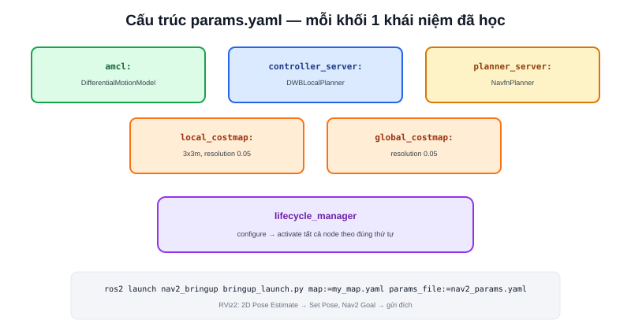

Các bài khác trong chuyên mục [Nav2](/blog/planner) giải thích từng khái niệm riêng lẻ. Bài này là bản ghép nối thực hành — cấu trúc `params.yaml` tối thiểu để Nav2 chạy được trên một robot vi sai thật, đúng loại robot đã dùng trong dự án [Diff Robot](/du-an/diff-robot) ở phần showcase của trang này.



## Cấu trúc params.yaml tối thiểu

```yaml
amcl:
  ros__parameters:
    robot_model_type: "nav2_amcl::DifferentialMotionModel"

controller_server:
  ros__parameters:
    controller_plugins: ["FollowPath"]
    FollowPath:
      plugin: "dwb_core::DWBLocalPlanner"
      max_vel_x: 0.3
      max_vel_theta: 1.0

planner_server:
  ros__parameters:
    planner_plugins: ["GridBased"]
    GridBased:
      plugin: "nav2_navfn_planner::NavfnPlanner"

local_costmap:
  local_costmap:
    ros__parameters:
      width: 3
      height: 3
      resolution: 0.05

global_costmap:
  global_costmap:
    ros__parameters:
      resolution: 0.05
```

Mỗi khối tương ứng đúng một khái niệm đã học ở các bài riêng: `amcl` (bài [AMCL trong Nav2](/blog/amcl-trong-nav2)), `controller_server`/`planner_server` (bài [Controller](/blog/controller)/[Planner](/blog/planner)), `local_costmap`/`global_costmap` (bài [Costmap](/blog/costmap)).

## Điểm riêng cho robot vi sai: robot_model_type

```yaml
robot_model_type: "nav2_amcl::DifferentialMotionModel"
```

AMCL cần biết mô hình chuyển động robot để dự đoán đúng khi di chuyển hạt (bước Predict, đã học ở bài [AMCL là gì?](/blog/amcl-la-gi)) — robot vi sai không thể đi ngang, mô hình chuyển động phản ánh đúng ràng buộc đó (khác với robot Mecanum cần `OmniMotionModel`). Chọn sai mô hình chuyển động khiến AMCL dự đoán các khả năng di chuyển mà robot thực tế không làm được, hội tụ kém chính xác hơn.

## Launch file: ghép các node lại

```python
from nav2_bringup.launch import RewrittenYaml
from launch_ros.actions import Node

Node(
    package="nav2_amcl", executable="amcl",
    parameters=[params_file], name="amcl",
),
Node(
    package="nav2_controller", executable="controller_server",
    parameters=[params_file],
),
Node(
    package="nav2_planner", executable="planner_server",
    parameters=[params_file],
),
Node(
    package="nav2_lifecycle_manager", executable="lifecycle_manager",
    parameters=[{"autostart": True, "node_names": ["amcl", "controller_server", "planner_server"]}],
),
```

Trong thực tế, phần lớn dự án dùng sẵn launch file `nav2_bringup` thay vì viết tay từng `Node()` như trên — nhưng hiểu được cấu trúc này giúp đọc/sửa launch file có sẵn dễ dàng hơn nhiều, thay vì coi nó như hộp đen.

> **Tóm lại:** `lifecycle_manager` (bài [Lifecycle Node](/blog/lifecycle-node)) luôn là node cuối cùng cần cấu hình — nó điều phối `configure`/`activate` cho tất cả node Nav2 khác theo đúng thứ tự, đảm bảo `amcl` sẵn sàng trước khi `controller_server` bắt đầu nhận lệnh.

## Chạy thử

```bash
ros2 launch nav2_bringup bringup_launch.py \
  map:=my_map.yaml \
  params_file:=nav2_params.yaml
```

Sau khi launch, mở RViz2 (bài [RViz2](/blog/rviz2)), dùng "2D Pose Estimate" để Set Pose ban đầu (bài [AMCL trong Nav2](/blog/amcl-trong-nav2)), rồi "Nav2 Goal" để gửi thử một điểm đích — nếu mọi cấu hình đúng, robot sẽ tự tính đường đi và di chuyển tới đích.

## Checklist debug khi Nav2 không chạy

| Triệu chứng | Kiểm tra |
|---|---|
| Robot không nhận Nav Goal | `lifecycle_manager` đã activate hết các node chưa (`ros2 lifecycle get`) |
| Robot đứng yên dù có path | Kiểm tra `/cmd_vel` có publisher/subscriber đúng chưa (bài [ros2 topic](/blog/ros2-topic)) |
| "could not transform" | Xem bài [TF Tree](/blog/tf-tree) |
| Robot đi lệch path | Xem bài [Tuning Controller](/blog/tuning-controller) |
