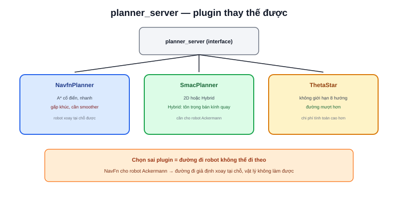

Bài [Path Planning là gì?](/blog/path-planning-la-gi) giải thích Dijkstra và A* ở mức thuật toán. `planner_server` là node ROS2 hiện thực hoá các thuật toán đó — kiến trúc **plugin**, cho phép đổi thuật toán tìm đường mà không cần đổi bất kỳ node nào khác trong hệ thống.



## planner_server là gì

```yaml
planner_server:
  ros__parameters:
    planner_plugins: ["GridBased"]
    GridBased:
      plugin: "nav2_navfn_planner::NavfnPlanner"
```

`planner_server` không tự chứa thuật toán — nó nạp một **plugin** cụ thể (khai trong `plugin:`) lúc runtime, đúng kiểu kiến trúc plugin đã thấy ở bài [Composition](/blog/composition) (dù đây là plugin-loading qua `pluginlib`, cơ chế khác composition nhưng cùng triết lý: tách interface khỏi implementation cụ thể).

## NavFn — A* cổ điển, ổn định

Triển khai A*/Dijkstra thuần tuý trên costmap (bài [Costmap](/blog/costmap)) — nhanh, đáng tin cậy, đã được kiểm chứng qua nhiều năm sử dụng trong ROS1/ROS2. Nhược điểm: đường đi sinh ra có thể có góc gấp khúc không tự nhiên (đặc trưng của tìm kiếm trên lưới ô vuông), cần `smoother_server` xử lý hậu kỳ trước khi giao cho controller bám theo.

## SmacPlanner — mới hơn, hỗ trợ ràng buộc động học

```text
SmacPlanner2D    — A* trên lưới, tương tự NavFn nhưng tối ưu hơn
SmacPlannerHybrid — tìm kiếm trong không gian trạng thái (x, y, θ),
                     tôn trọng bán kính quay tối thiểu của robot
```

Biến thể Hybrid quan trọng với robot có ràng buộc động học chặt (như Ackermann, bài [Chọn hệ truyền động](/blog/chon-he-truyen-dong-cho-amr)) — không thể xoay tại chỗ, đường đi sinh ra phải khả thi về mặt vật lý ngay từ bước lập kế hoạch, không chỉ đẹp trên lý thuyết đồ thị.

> **Tóm lại:** NavFn và SmacPlanner2D phù hợp cho robot có thể xoay tại chỗ (differential, mecanum, omni — đa số AMR trong nhà); SmacPlannerHybrid cần thiết khi robot có ràng buộc kiểu Ackermann không xoay tại chỗ được. Chọn sai plugin (ví dụ dùng NavFn cho robot Ackermann) sinh ra đường đi robot vật lý không thể đi theo được.

## ThetaStar — đường đi mượt hơn, ít điểm gấp khúc

Biến thể A* cho phép đường nối giữa các ô không nhất thiết phải theo 8 hướng cố định (ngang/dọc/chéo như A* lưới thuần) — kết quả là đường đi thẳng hơn, ít điểm gấp khúc hơn, gần với đường đi tối ưu hình học thực sự hơn NavFn/SmacPlanner2D, đổi lại chi phí tính toán cao hơn một chút.

## Bảng so sánh nhanh

| Plugin | Ràng buộc động học | Chất lượng đường đi | Chi phí tính toán |
|---|---|---|---|
| NavfnPlanner | Không | Có gấp khúc, cần smoother | Thấp |
| SmacPlanner2D | Không | Tốt hơn NavFn | Trung bình |
| SmacPlannerHybrid | Có (bán kính quay) | Khả thi vật lý cho Ackermann | Cao |
| ThetaStar | Không | Mượt, ít gấp khúc | Trung bình-cao |
