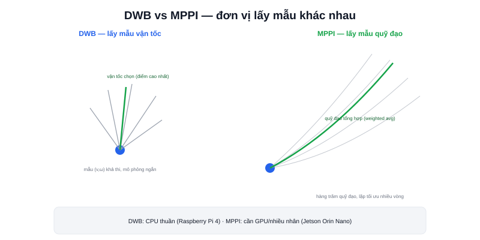

Bài [Path Following là gì?](/blog/path-following-la-gi) giới thiệu Pure Pursuit — đơn giản nhưng không tự nhiên xử lý vật cản động. `controller_server` trong Nav2 dùng các thuật toán phức tạp hơn: **DWB** và **MPPI** — cả hai đều đã được nhắc trong nội dung dự án [Atlas A2](/du-an/atlas-a2) ở phần showcase, đây là bài giải thích chi tiết hơn.



## DWB (Dynamic Window Approach) — lấy mẫu vận tốc, chấm điểm

```text
1. Lấy mẫu một tập vận tốc (v, ω) khả thi trong "cửa sổ động"
   (giới hạn bởi giới hạn gia tốc — bài Giới hạn gia tốc)
2. Với mỗi mẫu, mô phỏng ngắn hạn (vài giây) quỹ đạo nếu áp dụng vận tốc đó
3. Chấm điểm mỗi quỹ đạo mô phỏng bằng nhiều "critic" (tiêu chí):
   khoảng cách tới vật cản, độ lệch khỏi path, tốc độ tiến...
4. Chọn (v, ω) có tổng điểm cao nhất, áp dụng ngay, lặp lại chu kỳ sau
```

Nhẹ tính toán, chạy tốt trên CPU thuần (Raspberry Pi 4) — đây là lý do các dự án showcase dùng Raspberry Pi 4 (Robot Mecanum, Diff Robot) mặc định dùng DWB.

## MPPI (Model Predictive Path Integral) — lấy mẫu quỹ đạo, tối ưu lặp

```text
1. Lấy mẫu HÀNG TRĂM quỹ đạo tương lai khả dĩ (không chỉ vận tốc tức thời)
   dựa trên mô hình động học robot
2. Chấm điểm mỗi quỹ đạo bằng hàm chi phí (cost function)
3. Tổng hợp (weighted average) các quỹ đạo tốt thành một quỹ đạo tối ưu
4. Lặp lại tối ưu này nhiều vòng trong cùng một chu kỳ điều khiển
```

Chi phí tính toán cao hơn DWB nhiều (lấy mẫu số lượng lớn, lặp tối ưu nhiều vòng) — cần GPU hoặc CPU nhiều nhân để chạy mượt thời gian thực, đây là lý do dự án Atlas A2 (dùng Jetson Orin Nano) mới đủ khả năng chạy MPPI mượt, trong khi Robot Mecanum/Diff Robot (Raspberry Pi 4) hợp lý hơn với DWB.

> **Tóm lại:** Cả hai đều thuộc họ "sampling-based" (lấy mẫu rồi chọn tốt nhất), khác biệt cốt lõi ở đơn vị lấy mẫu — DWB lấy mẫu **vận tốc tức thời**, MPPI lấy mẫu **cả quỹ đạo tương lai**. Lấy mẫu quỹ đạo cho phép MPPI "nhìn xa hơn" khi né vật cản (dự đoán trước vài giây thay vì chỉ phản ứng tức thời), đổi lại đòi hỏi tài nguyên tính toán lớn hơn nhiều.

## Critic — thành phần chấm điểm có thể cấu hình riêng

```yaml
FollowPath:
  plugin: "dwb_core::DWBLocalPlanner"
  critics: ["ObstacleFootprint", "PathAlign", "GoalAlign", "PathDist", "Oscillation"]
  ObstacleFootprint.scale: 0.02
  PathAlign.scale: 32.0
```

Mỗi critic chấm điểm một khía cạnh khác nhau của quỹ đạo ứng viên (khoảng cách vật cản, độ bám path, hướng về đích...) — trọng số (`scale`) mỗi critic quyết định controller "ưu tiên" khía cạnh nào hơn. Đây chính là phần tham số hay cần tinh chỉnh nhất trong thực tế, bàn kỹ ở bài [Tuning Controller](/blog/tuning-controller) (chuyên mục Tuning Nav2).

## Bảng so sánh nhanh

| | DWB | MPPI |
|---|---|---|
| Đơn vị lấy mẫu | Vận tốc (v, ω) | Quỹ đạo tương lai |
| Chi phí tính toán | Thấp | Cao |
| Phù hợp phần cứng | CPU thuần (Raspberry Pi 4) | Cần GPU/nhiều nhân (Jetson) |
| Chất lượng né vật cản động | Tốt, phản ứng tức thời | Mượt hơn, "nhìn xa" hơn |
