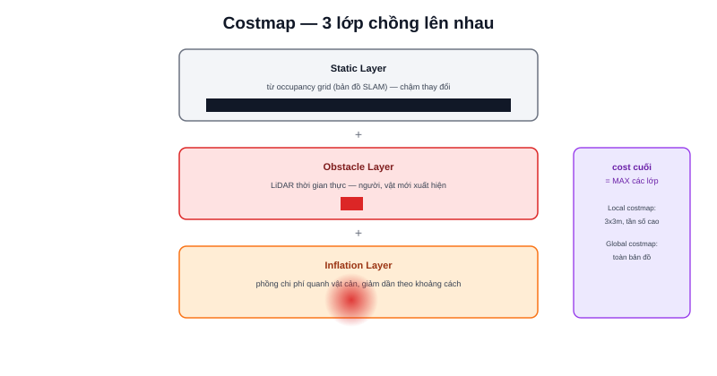

Bài [Occupancy Grid](/blog/map-occupancy-grid) chỉ có 3 giá trị mỗi ô. Nav2 không dùng thẳng occupancy grid cho việc lập kế hoạch — nó biến đổi thành **costmap**, nơi mỗi ô mang một **chi phí (cost)** liên tục, không chỉ nhị phân "có/không vật cản".



## Vì sao free/occupied nhị phân chưa đủ

Hai ô đều "free" nhưng một ô cách tường 5cm, một ô cách tường 2m — về mặt an toàn, chúng không tương đương. Costmap biểu diễn sự khác biệt này bằng giá trị chi phí liên tục (0-255): xa vật cản chi phí thấp, gần vật cản chi phí cao dần — planner/controller ưu tiên đi qua vùng chi phí thấp khi có nhiều lựa chọn khả thi.

## Ba lớp costmap phổ biến, chồng lên nhau

```text
Static Layer     — lấy trực tiếp từ occupancy grid (bản đồ SLAM đã dựng)
Obstacle Layer    — cập nhật thời gian thực từ cảm biến (LiDAR đang quét)
                     — vật cản KHÔNG có trong bản đồ tĩnh (người, xe đẩy mới xuất hiện)
Inflation Layer   — "phồng" chi phí ra xung quanh mỗi vật cản theo bán kính giảm dần
```

Các lớp chồng lên nhau, giá trị chi phí cuối cùng của mỗi ô là giá trị **cao nhất** trong số các lớp — một ô có thể "an toàn" theo Static Layer (không có trên bản đồ tĩnh) nhưng "nguy hiểm" theo Obstacle Layer (LiDAR vừa phát hiện vật cản mới ở đó ngay bây giờ).

> **Tóm lại:** Static Layer trả lời "bản đồ tĩnh nói gì" (chậm thay đổi), Obstacle Layer trả lời "cảm biến đang thấy gì ngay bây giờ" (thời gian thực), Inflation Layer biến "có/không vật cản" thành "nguy hiểm tới mức nào theo khoảng cách". Ba lớp bổ trợ, không thay thế nhau.

## Inflation Layer — vì sao cần "phồng" chi phí ra

Nếu chỉ đánh dấu đúng ô có vật cản là nguy hiểm, planner có thể tính ra đường đi sượt sát ngay mép vật cản — về lý thuyết "không chạm" nhưng không chừa biên độ an toàn cho sai số định vị/điều khiển thực tế. Inflation Layer giải quyết bằng cách lan toả chi phí ra các ô lân cận theo bán kính cấu hình được, giảm dần theo khoảng cách:

```yaml
inflation_layer:
  inflation_radius: 0.55      # bán kính lan toả (m)
  cost_scaling_factor: 3.0    # tốc độ giảm chi phí theo khoảng cách
```

`inflation_radius` nên đặt tối thiểu bằng bán kính robot (bài [Footprint](/blog/tuning-footprint) — chuyên mục Tuning Nav2) cộng thêm biên độ an toàn — quá nhỏ, robot có thể tính đường sượt sát vật cản; quá lớn, robot né quá xa, không lách qua được không gian hẹp dù về lý thuyết đủ rộng để đi qua.

## Local Costmap vs Global Costmap — khác nhau ở phạm vi

```text
Global Costmap — phủ TOÀN BỘ bản đồ, dùng cho planner_server tính đường đi tổng thể
Local Costmap  — chỉ phủ một vùng nhỏ quanh robot (ví dụ 3x3m), cập nhật tần số cao
                  dùng cho controller_server né vật cản tức thời
```

Local costmap nhỏ và cập nhật nhanh vì controller cần phản ứng tức thời với vật cản mới xuất hiện ngay gần robot; global costmap lớn nhưng không cần cập nhật nhanh bằng vì chỉ dùng để lập kế hoạch tổng thể, không phải né tránh tức thời.
