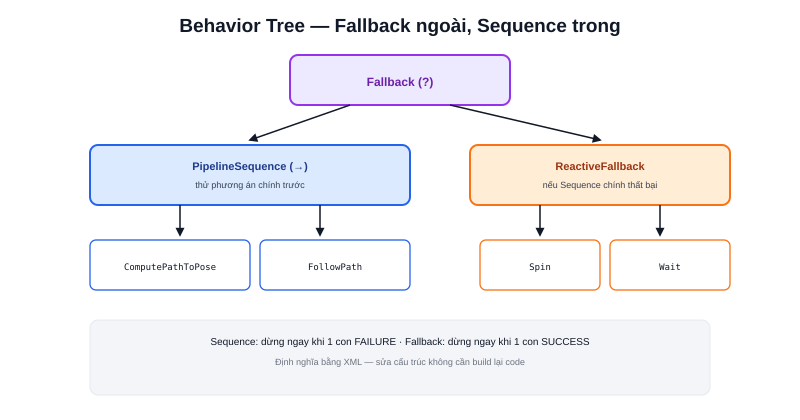

Các bài [Planner](/blog/planner) và [Controller](/blog/controller) giải quyết "tính đường đi" và "bám đường đi" — nhưng ai quyết định trình tự gọi hai việc đó, và phải làm gì khi một bước thất bại? Đây là vai trò của **Behavior Tree**, điều phối bởi node `bt_navigator`.



## Behavior Tree là gì — khác gì State Machine

```text
State Machine: các trạng thái nối với nhau bằng transition (IF điều kiện THEN chuyển trạng thái)
Behavior Tree: cấu trúc CÂY, mỗi node trả về một trong 3 kết quả:
    SUCCESS — hoàn thành
    FAILURE — thất bại
    RUNNING — đang chạy, chưa xong
```

Ưu điểm của Behavior Tree so với State Machine truyền thống: dễ **ghép lại** (compose) các hành vi nhỏ thành hành vi lớn hơn mà không cần vẽ lại toàn bộ sơ đồ transition — chỉ cần thêm một node con vào đúng vị trí trong cây.

## Hai loại node chính: Control Node và Action Node

```text
Control Node — quyết định thứ tự/điều kiện chạy các node con:
    Sequence   — chạy lần lượt, dừng ngay khi 1 con FAILURE
    Fallback   — thử lần lượt, dừng ngay khi 1 con SUCCESS (thử phương án tiếp theo nếu thất bại)

Action Node — thực thi công việc thật:
    ComputePathToPose  — gọi planner_server (bài Planner)
    FollowPath         — gọi controller_server (bài Controller)
    Spin, BackUp, Wait — gọi các recovery behavior (bài Recovery)
```

## Ví dụ cây đơn giản: điều hướng cơ bản

```xml
<BehaviorTree>
  <PipelineSequence>
    <ComputePathToPose goal="{goal}" path="{path}"/>
    <FollowPath path="{path}"/>
  </PipelineSequence>
</BehaviorTree>
```

`PipelineSequence` (biến thể của Sequence) chạy `ComputePathToPose` trước — nếu SUCCESS, chuyển sang `FollowPath`. Nếu `ComputePathToPose` FAILURE (không tìm được đường đi), toàn bộ cây trả về FAILURE ngay, không chạy `FollowPath`.

> **Tóm lại:** Behavior Tree không chứa logic thuật toán (planner/controller làm việc đó) — nó chỉ chứa logic **điều phối**: gọi cái gì, theo thứ tự nào, làm gì khi thất bại. Tách logic điều phối khỏi logic thuật toán giúp mỗi phần dễ hiểu, dễ test độc lập hơn nhiều so với gộp chung vào một khối code lớn.

## Kết hợp Recovery khi Fallback

```xml
<Fallback>
  <PipelineSequence>
    <ComputePathToPose goal="{goal}" path="{path}"/>
    <FollowPath path="{path}"/>
  </PipelineSequence>
  <ReactiveFallback>
    <Spin spin_dist="1.57"/>
    <Wait wait_duration="5"/>
  </ReactiveFallback>
</Fallback>
```

Nếu luồng chính (Sequence trên) thất bại — ví dụ `FollowPath` bị kẹt — `Fallback` cấp cao hơn chuyển sang thử recovery behavior (bài [Recovery](/blog/recovery)): xoay tại chỗ để "nhìn" rõ hơn, rồi thử lại. Đây chính xác là cơ chế bên dưới hành vi "robot tự xoay khi bị kẹt" thường thấy ở AMR thực tế.

## XML dễ đọc, dễ tuỳ biến mà không cần build lại code

Behavior Tree trong Nav2 được định nghĩa bằng file XML riêng biệt (không nhúng trong code C++/Python) — đổi cấu trúc điều phối (thêm bước recovery mới, đổi thứ tự thử) chỉ cần sửa file XML và restart `bt_navigator`, không cần biên dịch lại bất kỳ node nào — đúng tinh thần tách cấu hình khỏi code đã thấy nhiều lần ở các bài [Parameter](/blog/parameter) và [Launch File](/blog/launch-file).
