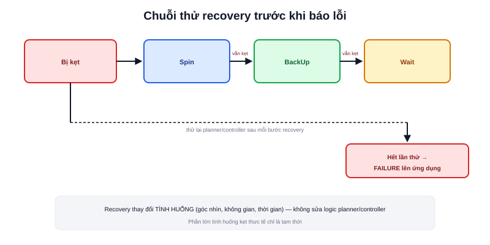

Bài [Behavior Tree](/blog/behavior-tree) đã cho thấy `Fallback` chuyển sang nhánh recovery khi luồng chính thất bại. Bài này đi vào chi tiết các **recovery behavior** cụ thể — hành vi robot thực hiện để tự thoát khỏi tình huống bế tắc, trước khi thực sự báo lỗi lên tầng ứng dụng.



## Ba recovery behavior phổ biến

```text
Spin      — xoay tại chỗ một góc — "nhìn" rõ hơn môi trường xung quanh,
            đôi khi đủ để costmap cập nhật lại và thấy đường đi mới
BackUp    — lùi một đoạn ngắn — thoát khỏi tình huống quá gần vật cản
            phía trước, tạo thêm không gian cho planner tính lại
Wait      — đứng yên một khoảng thời gian — hữu ích khi vật cản là
            người/vật đang di chuyển, chỉ cần đợi họ đi qua
ClearEntireCostmap — xoá sạch costmap cục bộ, buộc dựng lại từ dữ liệu
            cảm biến mới nhất — hữu ích khi costmap "kẹt" dữ liệu cũ sai
```

## Vì sao cần thử nhiều cách trước khi báo lỗi

```text
Không có recovery: 1 lần thất bại → robot dừng, chờ người can thiệp
Có recovery: thất bại → thử Spin → vẫn thất bại → thử BackUp
             → vẫn thất bại → thử Wait → ... → mới thực sự báo lỗi
```

Phần lớn tình huống "kẹt" trong thực tế là tạm thời (người đi ngang qua, costmap có dữ liệu nhiễu tạm thời) — recovery behavior cho robot cơ hội tự thoát ra mà không cần con người can thiệp mỗi lần, đúng tinh thần tự động hoá mà cả hệ Navigation hướng tới.

> **Tóm lại:** Recovery không phải "sửa lỗi thuật toán" — planner/controller vẫn đúng logic của chúng, chỉ là tình huống hiện tại (costmap có dữ liệu tạm thời sai, hoặc robot ở vị trí khó) khiến chúng thất bại. Recovery thay đổi **tình huống** (xoay để thấy góc khác, lùi để có thêm không gian, đợi để vật cản động di chuyển đi) rồi để planner/controller thử lại với tình huống mới, không phải thay thế logic của chúng.

## Cấu hình số lần thử trước khi bỏ cuộc

```yaml
bt_navigator:
  ros__parameters:
    default_nav_to_pose_bt_xml: navigate_to_pose_w_replanning_and_recovery.xml

recoveries_server:
  ros__parameters:
    recovery_plugins: ["spin", "backup", "wait"]
    spin:
      plugin: "nav2_behaviors::Spin"
```

Số lần lặp lại chuỗi recovery trước khi thực sự trả về FAILURE lên tầng ứng dụng thường được cấu hình ngay trong file Behavior Tree XML (qua `RecoveryNode` với tham số `number_of_retries`) — không giới hạn cứng trong code, dễ điều chỉnh theo đặc thù môi trường vận hành (môi trường đông người có thể cần nhiều lần thử `Wait` hơn môi trường tĩnh).

## Khi nào recovery cũng không đủ — báo lỗi lên tầng ứng dụng

Sau khi hết số lần thử recovery cấu hình, Behavior Tree trả về FAILURE cuối cùng lên node đã gọi nó (thường là action server `NavigateToPose`) — tầng ứng dụng (logic nghiệp vụ cụ thể, đã nhắc ở bài [Bức tranh toàn cảnh phần mềm robot](/blog/buc-tranh-toan-canh-phan-mem-robot-ros2-slam-nav2)) nhận được thông báo thất bại này và quyết định bước tiếp theo — có thể là báo cho người vận hành, thử lại sau một khoảng thời gian, hoặc chuyển sang nhiệm vụ khác.
