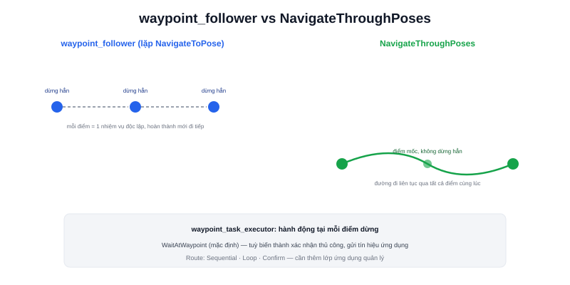

Mọi bài trước trong chuyên mục Nav2 đều nói về đi tới **một** điểm đích (`NavigateToPose`). Robot giao hàng thực tế thường cần ghé qua **nhiều điểm liên tiếp** trong một nhiệm vụ — lấy hàng ở điểm A, giao ở điểm B, quay về trạm sạc ở điểm C. Đây là vai trò của **Waypoint Follower**.



## Hai cách tiếp cận: gọi lặp lại vs một action duy nhất

```text
Cách 1 — waypoint_follower gọi NavigateToPose lặp lại:
    đi tới điểm 1 (dừng hẳn) → đi tới điểm 2 (dừng hẳn) → ...
    mỗi điểm là một action riêng, hoàn thành xong mới bắt đầu điểm tiếp

Cách 2 — NavigateThroughPoses (action riêng của Nav2):
    lập kế hoạch đường đi liên tục QUA tất cả các điểm cùng lúc,
    không nhất thiết dừng hẳn tại mỗi điểm trung gian
```

Cách 1 phù hợp khi mỗi điểm cần một hành động thực sự dừng lại (lấy hàng, chờ xác nhận — giống mô hình dừng ở trạm của Atlas A2 trong phần showcase của trang này). Cách 2 phù hợp khi các điểm chỉ là "điểm phải đi qua" trên đường tới đích cuối, không cần dừng hẳn — đường đi mượt hơn, không có các lần dừng-khởi động không cần thiết.

> **Tóm lại:** `NavigateToPose` lặp lại qua `waypoint_follower` = nhiều nhiệm vụ độc lập nối tiếp nhau, mỗi nhiệm vụ hoàn thành trọn vẹn (dừng hẳn) trước khi bắt đầu nhiệm vụ sau. `NavigateThroughPoses` = một nhiệm vụ duy nhất với nhiều điểm mốc trung gian, đường đi liên tục không dừng.

## Task Executor — hành động tại mỗi waypoint

```yaml
waypoint_follower:
  ros__parameters:
    waypoint_task_executor_plugin: "wait_at_waypoint"
    wait_at_waypoint:
      plugin: "nav2_waypoint_follower::WaitAtWaypoint"
      waypoint_pause_duration: 3000   # dừng 3 giây tại mỗi điểm
```

Plugin `waypoint_task_executor` cho phép gắn một hành động cụ thể tại mỗi điểm dừng — mặc định là dừng chờ một khoảng thời gian (`WaitAtWaypoint`), nhưng có thể tuỳ biến thành hành động nghiệp vụ thực tế (gửi tín hiệu "đã tới nơi" cho ứng dụng bên ngoài, chờ xác nhận thủ công — giống chế độ `confirm` đã nhắc trong nội dung dự án Atlas A2).

## Route type: tuần tự hay lặp vòng

```text
Sequential — đi hết danh sách điểm rồi dừng
Loop       — đi hết danh sách rồi quay lại điểm đầu, lặp vô hạn
Confirm    — dừng chờ xác nhận thủ công tại mỗi điểm trước khi đi tiếp
```

Ba kiểu route này không phải tính năng có sẵn "cắm là chạy" của `nav2_waypoint_follower` thuần — thường cần thêm một lớp logic ứng dụng (application layer, đã nhắc ở bài Bức tranh toàn cảnh phần mềm robot) quản lý danh sách waypoint và gọi `waypoint_follower`/`NavigateThroughPoses` theo đúng kiểu route mong muốn, đúng như cách app điều khiển của Atlas A2 quản lý waypoints qua giao diện kéo-thả.

## Huỷ giữa chừng

```bash
ros2 action send_goal /follow_waypoints nav2_msgs/action/FollowWaypoints "{...}" --feedback
# Ctrl+C để huỷ, giống cơ chế đã học ở bài ros2 action
```

Đúng cơ chế huỷ action đã học ở bài [ros2 action](/blog/ros2-action) — `FollowWaypoints` là một action có feedback (điểm hiện tại đang đi tới, số điểm còn lại) và có thể huỷ giữa chừng bất kỳ lúc nào.
