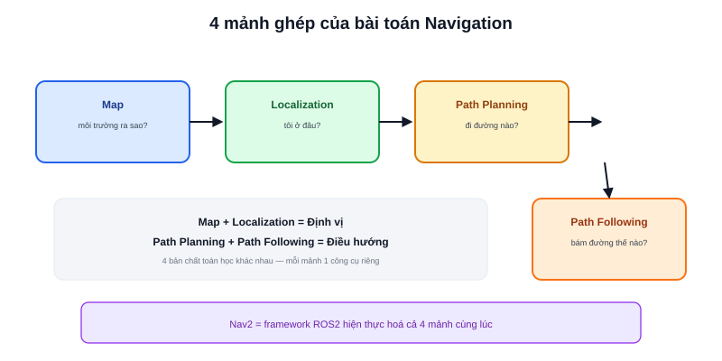

"Navigation" trong robot học không phải một thuật toán duy nhất — nó là tên gọi chung cho bốn bài toán con phải giải **đồng thời** để robot tự di chuyển từ điểm A đến điểm B mà không cần con người lái. Chuyên mục này lần lượt đi qua từng mảnh ghép, trước khi ghép chúng vào Nav2 (chuyên mục riêng).



## Bốn câu hỏi robot phải trả lời

```text
1. Map           — môi trường xung quanh trông như thế nào?
2. Localization   — tôi đang ở đâu trong môi trường đó?
3. Path Planning  — đường đi nào từ đây tới đích?
4. Path Following — làm sao bám đúng đường đi đó khi đang di chuyển?
```

Bốn câu hỏi này phụ thuộc lẫn nhau theo một chuỗi rõ ràng: không có Map thì Localization vô nghĩa (định vị trên cái gì?); không có Localization thì Path Planning vô nghĩa (tính đường đi từ đâu?); không có Path Planning thì Path Following không có gì để bám theo.

## Mỗi mảnh ghép, một bài riêng trong chuyên mục này

- **[Map](/blog/map-occupancy-grid)** — bản đồ occupancy grid là gì, lưu trữ ra sao
- **[Localization](/blog/localization-trong-navigation)** — tổng quan cách robot tự định vị (chi tiết đầy đủ ở chuyên mục Localization và Robotics Fundamentals)
- **[Path Planning](/blog/path-planning-la-gi)** — thuật toán tìm đường tổng quát (Dijkstra, A*)
- **[Path Following](/blog/path-following-la-gi)** — thuật toán bám đường tổng quát

> **Tóm lại:** Map và Localization trả lời "tôi đang ở đâu, thế giới trông ra sao" — thuộc nhóm bài toán **định vị**. Path Planning và Path Following trả lời "tôi cần đi đâu, đi thế nào" — thuộc nhóm bài toán **điều hướng**. Bốn mảnh ghép chia đúng làm hai nhóm này, và Nav2 (chuyên mục riêng) là framework ROS2 hiện thực hoá cả bốn cùng lúc trong một hệ thống thống nhất.

## Vì sao tách 4 mảnh riêng thay vì một thuật toán duy nhất

Mỗi mảnh ghép giải quyết một bản chất bài toán khác hẳn nhau — Map là bài toán biểu diễn dữ liệu không gian, Localization là bài toán ước lượng xác suất (đã bàn ở bài [AMCL](/blog/amcl-la-gi)), Path Planning là bài toán tìm kiếm trên đồ thị (graph search), Path Following là bài toán điều khiển thời gian thực (đã bàn ở chuyên mục Điều khiển Robot). Tách riêng cho phép mỗi mảnh dùng đúng công cụ toán học phù hợp nhất với bản chất bài toán của nó, thay vì gò ép vào một framework chung không phù hợp với tất cả.

## Từ đây tới Nav2

Chuyên mục Navigation cơ bản này trình bày **khái niệm tổng quát**, không gắn với một framework cụ thể — các thuật toán A*, Dijkstra tồn tại từ trước ROS2 rất lâu, dùng trong game, robotics công nghiệp, GPS. Chuyên mục [Nav2](/blog/planner) sẽ đi tiếp vào cách ROS2 hiện thực hoá các khái niệm này thành `planner_server`, `controller_server`, và các plugin cụ thể.
