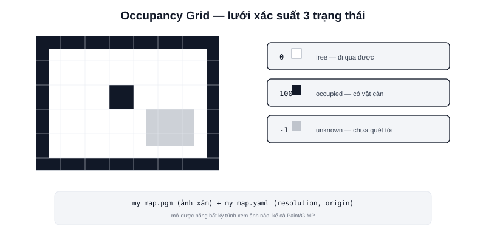

Bài [Navigation là gì?](/blog/navigation-la-gi) đặt Map là mảnh ghép đầu tiên. Định dạng bản đồ chuẩn trong ROS2 — **Occupancy Grid** — đơn giản hơn nhiều so với "bản đồ" theo nghĩa thông thường: chỉ là một lưới ô vuông, mỗi ô mang một giá trị xác suất.



## Cấu trúc: lưới ô vuông, mỗi ô một giá trị xác suất

```text
Mỗi ô (cell) trong grid mang một trong ba trạng thái:
  0    → free (trống, robot đi qua được)
  100  → occupied (có vật cản)
  -1   → unknown (chưa quét tới, không rõ)
```

Toàn bộ bản đồ chẳng qua là một mảng 2D các số nguyên này — publish trên topic `/map` với message type `nav_msgs/msg/OccupancyGrid`, kèm theo `resolution` (kích thước thật của mỗi ô, ví dụ 0.05m = 5cm/ô) và `origin` (toạ độ thực của góc bản đồ, để chuyển đổi giữa chỉ số ô và toạ độ thế giới thực trong hệ `map`, đã nói ở bài [Hệ toạ độ trong Robot](/blog/he-toa-do-trong-robot)).

## Lưu trên đĩa: file .pgm + .yaml

```text
my_map.pgm    — ảnh xám (grayscale) thực sự, trắng=free, đen=occupied, xám=unknown
my_map.yaml   — metadata: resolution, origin, ngưỡng free/occupied
```

`.pgm` (Portable GrayMap) là định dạng ảnh xám cực đơn giản, mở được bằng bất kỳ trình xem ảnh nào — đây là lý do bạn có thể **mở bản đồ robot bằng Paint hoặc GIMP để sửa tay** (xoá nhiễu, vẽ thêm tường ảo) trước khi nạp lại vào robot, không cần công cụ chuyên dụng.

> **Tóm lại:** Occupancy Grid cố tình đơn giản — chỉ 3 trạng thái mỗi ô, lưu dưới dạng ảnh xám phổ thông — đổi lại sự đơn giản đó là khả năng tương thích rộng: mọi công cụ SLAM, mọi thuật toán path planning, mọi phần mềm chỉnh sửa ảnh thông thường đều đọc/ghi được cùng một định dạng.

## map_server: đọc bản đồ đã lưu, phát lại lên topic

```bash
ros2 run nav2_map_server map_server --ros-args -p yaml_filename:=my_map.yaml
```

Sau khi SLAM (chuyên mục riêng) đã dựng và lưu xong bản đồ, `map_server` là node đọc file `.yaml`/`.pgm` này và publish lại lên topic `/map` — đây là bước chuyển từ "đang dựng bản đồ" (SLAM) sang "dùng bản đồ đã có" (AMCL + Nav2), đúng ranh giới đã nói ở bài [AMCL là gì?](/blog/amcl-la-gi).

## Độ phân giải (resolution) — đánh đổi chi tiết và dung lượng

```text
resolution càng nhỏ (ô càng nhỏ) → bản đồ chi tiết hơn, phát hiện vật cản nhỏ tốt hơn
                                  → file lớn hơn, tính toán costmap chậm hơn
resolution càng lớn (ô càng to)  → nhẹ, nhanh, nhưng bỏ sót vật cản nhỏ
```

Giá trị phổ biến cho AMR trong nhà: 0.05m (5cm/ô) — đủ chi tiết để phân biệt chân bàn, cột nhỏ, mà vẫn giữ kích thước file và tốc độ tính toán costmap hợp lý trên phần cứng nhúng như Raspberry Pi 4 hay Jetson Orin Nano.
