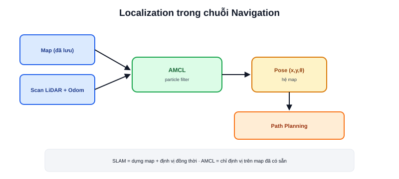

Bài [Navigation là gì?](/blog/navigation-la-gi) đặt Localization là mảnh ghép thứ hai. Lý thuyết chi tiết (Odometry, IMU, Sensor Fusion, EKF, AMCL) đã có đầy đủ ở chuyên mục [Localization](/blog/odometry-trong-localization) thuộc Robotics Fundamentals — bài này chỉ nối chúng vào đúng vị trí trong luồng Navigation.



## Localization cần Map làm đầu vào

Khác với Odometry (dead reckoning thuần, không cần biết gì về môi trường — bài [Odometry trong Localization](/blog/odometry-trong-localization)), Localization trong ngữ cảnh Navigation cụ thể là **AMCL** — định vị trên một bản đồ **đã có sẵn** (bài [Map](/blog/map-occupancy-grid) vừa nói). Không có bản đồ, AMCL không có gì để so khớp scan LiDAR vào, không hoạt động được.

```text
Map (đã lưu sẵn) + Scan LiDAR (thời gian thực) + Odometry (thời gian thực)
    → AMCL → Pose ước lượng (x, y, θ) trong hệ map
```

## Đầu ra của Localization là đầu vào của Path Planning

Path Planning (bài tiếp theo) cần biết chính xác "robot đang ở đâu trên bản đồ" để tính đường đi từ đó tới đích — chuỗi phụ thuộc `Map → Localization → Path Planning` đã nói ở bài Navigation là gì? chính xác là đường đi này.

> **Tóm lại:** Trong ngữ cảnh Navigation, "Localization" hầu như luôn đồng nghĩa với AMCL — bộ định vị hoạt động **trên một bản đồ tĩnh đã biết trước**, khác với SLAM (chuyên mục riêng) vừa dựng bản đồ vừa định vị đồng thời. Đọc thêm lý thuyết đầy đủ ở bài [AMCL là gì?](/blog/amcl-la-gi), và cấu hình thực tế trong ROS2 ở bài [AMCL trong Nav2](/blog/amcl-trong-nav2) (chuyên mục Localization).

## SLAM và Localization không chạy cùng lúc trong vận hành bình thường

```text
Giai đoạn 1 — SLAM: chưa có map → vừa dựng map vừa định vị (đắt tính toán hơn)
Giai đoạn 2 — Localization (AMCL): map đã có → chỉ định vị (nhẹ hơn nhiều)
```

Quy trình chuẩn của một AMR: chạy SLAM một lần để dựng và lưu bản đồ khu vực, sau đó chuyển hẳn sang AMCL cho các phiên vận hành tiếp theo — không chạy SLAM liên tục suốt vòng đời robot trừ khi môi trường thực sự thay đổi thường xuyên (cần dựng lại bản đồ).
