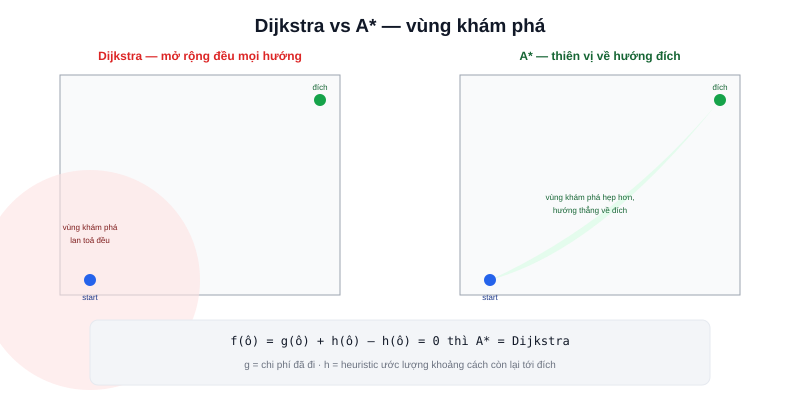

Bài [Navigation là gì?](/blog/navigation-la-gi) đặt Path Planning là bước tính "đường đi nào từ đây tới đích". Đây là bài toán kinh điển của khoa học máy tính, có từ trước robot học rất lâu — coi bản đồ (bài [Occupancy Grid](/blog/map-occupancy-grid)) như một **đồ thị**, mỗi ô trống là một đỉnh, các ô liền kề nối với nhau bằng cạnh.



## Dijkstra — mở rộng đều theo mọi hướng

Từ điểm xuất phát, Dijkstra khám phá dần các ô lân cận theo thứ tự chi phí tăng dần — luôn xử lý ô có tổng chi phí thấp nhất tiếp theo, không quan tâm ô đó có gần đích hay không:

```text
1. Đặt chi phí điểm xuất phát = 0, mọi ô khác = vô cực
2. Lặp lại: chọn ô CHƯA xử lý có chi phí thấp nhất
3. Cập nhật chi phí các ô lân cận nếu đi qua ô hiện tại rẻ hơn
4. Dừng khi đã xử lý tới ô đích
```

Đảm bảo tìm được đường đi **ngắn nhất tuyệt đối** — nhưng lãng phí thời gian khám phá cả những vùng không liên quan gì tới đích, vì không có khái niệm "hướng về đích".

## A* — Dijkstra cộng thêm "linh cảm" hướng về đích

A* (đọc "A sao") thêm một thành phần **heuristic** — ước lượng khoảng cách còn lại tới đích (thường dùng khoảng cách đường thẳng) — vào công thức chọn ô xử lý tiếp theo:

```text
f(ô) = g(ô) + h(ô)
  g(ô) = chi phí thực tế đã đi từ điểm xuất phát tới ô này
  h(ô) = ước lượng chi phí còn lại từ ô này tới đích (heuristic)
```

Ô có `f(ô)` nhỏ nhất được xử lý trước — kết quả là A* "thiên vị" khám phá về phía đích thay vì mở rộng đều mọi hướng như Dijkstra, tìm ra đường đi nhanh hơn nhiều trong hầu hết trường hợp thực tế, **vẫn đảm bảo đường đi ngắn nhất** nếu heuristic không bao giờ ước lượng quá cao thực tế (gọi là heuristic "admissible").

> **Tóm lại:** Dijkstra = A* với heuristic luôn bằng 0 (không có "linh cảm" gì về hướng đích) — về bản chất, A* là bản tổng quát hơn, Dijkstra chỉ là một trường hợp đặc biệt của nó. Trong thực tế Nav2, các planner phổ biến (NavFn, SmacPlanner — bài [Planner trong Nav2](/blog/planner)) đều dựa trên nền tảng A*/Dijkstra này, chỉ khác nhau ở cách tối ưu tốc độ tính toán và chất lượng đường đi sinh ra.

## Kết quả chỉ là một Path — chưa có chiều thời gian

Kết quả của Path Planning đúng như đã nói ở bài [Trajectory](/blog/quy-dao-trajectory) (chuyên mục Điều khiển Robot) — chỉ là một **path** tĩnh, chuỗi điểm không kèm thông tin thời gian. Việc biến path này thành chuyển động thực tế theo thời gian là việc của Path Following (bài tiếp theo).

## Bảng so sánh nhanh

| | Dijkstra | A* |
|---|---|---|
| Heuristic | Không có | Có (ước lượng khoảng cách tới đích) |
| Tốc độ | Chậm hơn (khám phá đều mọi hướng) | Nhanh hơn (thiên vị về đích) |
| Đảm bảo tối ưu | Có | Có (nếu heuristic admissible) |
| Dùng khi | Cần đường đi tối ưu tuyệt đối, không quan tâm tốc độ tính | Cần cân bằng tốc độ và chất lượng — phổ biến hơn trong thực tế |
