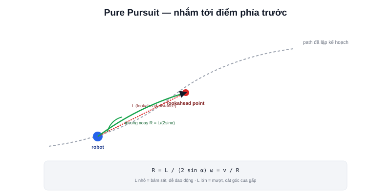

Bài [Path Planning](/blog/path-planning-la-gi) cho ra một **path** — chuỗi điểm tĩnh từ A tới đích. Path Following là bước cuối: biến chuỗi điểm đó thành lệnh vận tốc `(v, ω)` thực tế, gửi xuống robot mỗi chu kỳ điều khiển — đúng khái niệm **trajectory** đã học ở bài [Trajectory](/blog/quy-dao-trajectory).



## Pure Pursuit — thuật toán kinh điển, trực giác đơn giản nhất

Ý tưởng: thay vì cố bám sát tuyệt đối từng điểm trên path, chọn một **điểm mục tiêu (lookahead point)** nằm phía trước trên path, cách vị trí hiện tại một khoảng cố định (lookahead distance), rồi tính vận tốc góc cần thiết để cua tới đúng điểm đó — giống cách người lái xe không nhìn chằm chằm vào vạch kẻ ngay dưới bánh xe, mà nhìn một đoạn phía trước để lái mượt.

```text
1. Tìm điểm trên path cách vị trí hiện tại đúng "lookahead distance" L
2. Tính góc α giữa hướng robot hiện tại và hướng tới điểm đó
3. Tính bán kính cua cần thiết: R = L / (2·sin(α))
4. Suy ra vận tốc góc: ω = v / R
```

## Lookahead distance — tham số quan trọng nhất

```text
L nhỏ  → bám sát path chính xác hơn, nhưng dễ dao động (zig-zag) ở tốc độ cao
L lớn  → chuyển động mượt hơn, nhưng cắt góc nhiều hơn ở các khúc cua gấp
```

Đây là đánh đổi kinh điển của Pure Pursuit — không có giá trị `L` nào tối ưu cho mọi tình huống, nhiều triển khai thực tế **thay đổi `L` động theo tốc độ hiện tại** (tốc độ cao dùng `L` lớn hơn để tránh dao động, tốc độ thấp dùng `L` nhỏ hơn để bám sát hơn khi cần độ chính xác, ví dụ lúc docking).

> **Tóm lại:** Pure Pursuit đơn giản, tính toán nhẹ, đủ tốt cho phần lớn AMR tốc độ thấp-trung bình trong nhà — nhưng không tự nhiên xử lý được vật cản động (chỉ bám path tĩnh, không "nhìn thấy" người đi bộ cắt ngang). Đây là lý do Nav2 dùng các controller phức tạp hơn (DWB, MPPI — bài [Controller trong Nav2](/blog/controller)) thay vì Pure Pursuit thuần tuý làm mặc định, dù Pure Pursuit vẫn có mặt như một plugin lựa chọn (Regulated Pure Pursuit Controller).

## Path Following khác Path Planning ở tần số chạy

```text
Path Planning: chạy 1 lần khi có goal mới (hoặc khi bản đồ thay đổi lớn)
Path Following: chạy liên tục mỗi chu kỳ điều khiển (thường 10-50Hz)
```

Chính xác cùng phân biệt "path tĩnh" vs "trajectory theo thời gian" đã nói ở bài Trajectory — Path Planning tính một lần, Path Following phải tính lại liên tục để phản ứng kịp với sai lệch thực tế (robot không bao giờ bám path hoàn hảo 100%) và vật cản mới phát sinh.
