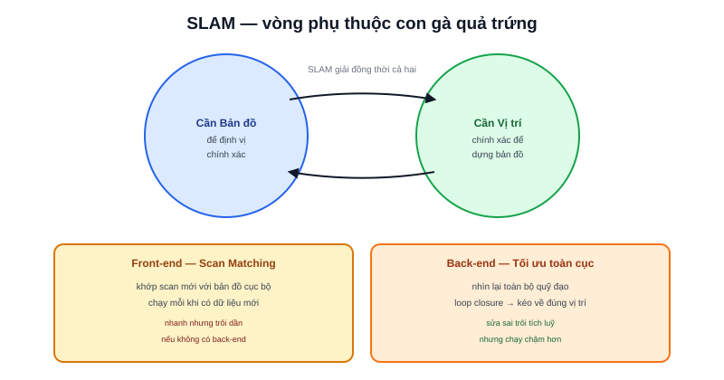

Bài [Localization trong Navigation](/blog/localization-trong-navigation) giả định đã có sẵn bản đồ. Nhưng bản đồ đó từ đâu ra? **SLAM (Simultaneous Localization and Mapping)** là câu trả lời — và cái tên đã nói lên bản chất vấn đề: định vị và dựng bản đồ phải giải **đồng thời**, không thể tách rời.



## Bài toán con gà quả trứng

```text
Cần bản đồ ĐÃ CÓ để định vị chính xác (như AMCL đã học)
     nhưng
Cần vị trí CHÍNH XÁC để dựng bản đồ đúng (mỗi lần đo LiDAR phải biết
     đang đo từ đâu mới ghép đúng vào bản đồ)
```

Đây là vòng lặp phụ thuộc kinh điển — không có điểm khởi đầu "sạch" nào để bắt đầu. SLAM giải quyết bằng cách ước lượng **đồng thời cả hai**, chấp nhận cả hai đều có sai số ban đầu, rồi liên tục tinh chỉnh chúng cùng nhau khi có thêm dữ liệu.

## Kiến trúc chung: Front-end và Back-end

Mọi hệ SLAM hiện đại, bất kể thuật toán cụ thể (slam_toolbox, Cartographer — hai bài tiếp theo), đều tách xử lý thành hai tầng:

- **Front-end — Scan Matching** — khớp lần quét LiDAR hiện tại với bản đồ cục bộ đã dựng được, ước lượng vị trí tức thời. Đây là công việc "thời gian thực", chạy mỗi khi có scan mới
- **Back-end — Tối ưu toàn cục** — định kỳ nhìn lại **toàn bộ** quỹ đạo đã đi qua và các ràng buộc đã thu thập, điều chỉnh lại để mọi thứ nhất quán với nhau — đặc biệt quan trọng khi có **loop closure**

> **Tóm lại:** Front-end trả lời "vị trí ngay bây giờ là gì" nhanh nhưng có thể sai lệch tích luỹ; Back-end trả lời "toàn bộ quỹ đạo từ trước tới giờ có nhất quán không" chậm hơn nhưng sửa được sai lệch đó. Hai tầng bổ trợ nhau — chỉ front-end thì trôi dần như odometry thuần (bài [Odometry](/blog/odometry-trong-localization)), chỉ back-end thì không đủ nhanh để dùng thời gian thực.

## Loop Closure — khoảnh khắc "à, tôi đã tới đây rồi"

Khi robot đi một vòng và quay lại đúng vị trí đã từng đi qua, hệ SLAM **nhận diện lại** được điểm đó (so khớp scan hiện tại với scan cũ đã lưu) — đây gọi là loop closure. Phát hiện được loop closure cho phép back-end "kéo" toàn bộ quỹ đạo đã đi qua về đúng vị trí thực, triệt tiêu phần lớn sai số trôi đã tích luỹ suốt quãng đường vừa đi.

```text
Không có loop closure: sai số trôi tích luỹ không giới hạn, bản đồ méo dần
Có loop closure:        sai số được "chốt lại" mỗi khi quay lại điểm cũ
```

Đây là lý do quy trình quét bản đồ thực tế (bài [Mapping thực tế](/blog/mapping-thuc-te)) luôn khuyến khích đi thành các vòng khép kín thay vì chỉ đi các đường thẳng một chiều — càng nhiều cơ hội loop closure, bản đồ cuối cùng càng chính xác.

## Hai lựa chọn phổ biến trong ROS2

Chuyên mục này tiếp tục với hai hệ SLAM phổ biến nhất trong ROS2 — **[slam_toolbox](/blog/slam-toolbox)** (cộng đồng ROS2, nhiều chế độ linh hoạt) và **[Cartographer](/blog/cartographer)** (Google, kiến trúc submap + pose-graph optimization) — cả hai đều hiện thực hoá đúng khung Front-end/Back-end vừa nói, chỉ khác nhau ở chi tiết thuật toán và trải nghiệm sử dụng.
