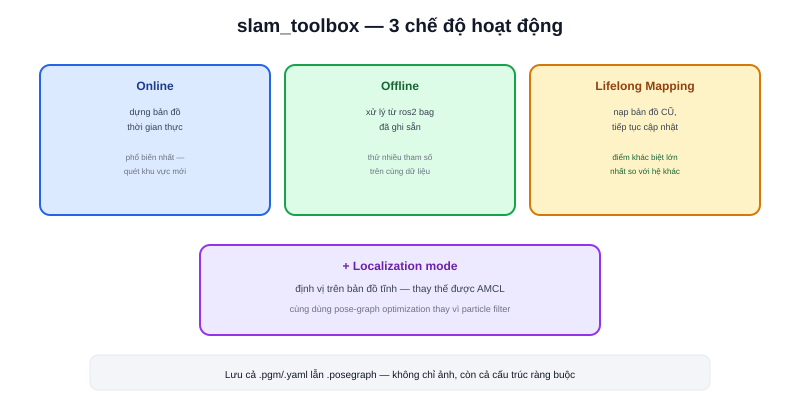

Bài [SLAM là gì?](/blog/slam-la-gi) đã trình bày khung Front-end/Back-end chung. **slam_toolbox** — package do cộng đồng ROS2 phát triển (Steve Macenski) — hiện thực hoá khung đó với một điểm mạnh nổi bật: không chỉ dựng bản đồ mới, mà còn linh hoạt nạp lại, map tiếp, và định vị trên bản đồ cũ.



## Ba chế độ hoạt động

```text
Online (mapping trực tiếp)
  → dựng bản đồ theo thời gian thực trong lúc robot di chuyển
  → chế độ phổ biến nhất, dùng khi lần đầu quét một khu vực mới

Offline (xử lý sau)
  → nạp lại dữ liệu đã ghi (ros2 bag — đã học ở bài riêng) để dựng bản đồ
  → hữu ích khi muốn thử nhiều tham số khác nhau trên cùng một lần quét thật

Lifelong mapping
  → nạp bản đồ ĐÃ CÓ, tiếp tục dựng thêm/cập nhật thay vì bắt đầu từ đầu
  → khu vực thay đổi (thêm kệ hàng mới) không cần quét lại toàn bộ từ số 0
```

Chế độ **lifelong mapping** là điểm khác biệt lớn nhất so với nhiều hệ SLAM khác — hầu hết chỉ hỗ trợ dựng bản đồ mới từ đầu, không có cách "cập nhật thêm" vào bản đồ cũ mà không mất dữ liệu đã có.

## Localization mode — thay thế được AMCL

```text
slam_toolbox có chế độ Localization riêng:
  → định vị trên bản đồ TĨNH đã lưu, giống hệt vai trò của AMCL
  → nhưng vẫn dùng chung engine pose-graph optimization của SLAM
```

Đây là lựa chọn thay thế cho AMCL (bài [AMCL trong Nav2](/blog/amcl-trong-nav2)) — cùng giải bài toán định vị trên bản đồ có sẵn, nhưng bằng pose-graph optimization thay vì particle filter. Dùng chung một package cho cả mapping lẫn localization giúp giảm số lượng dependency cần quản lý trong hệ thống, đổi lại mất đi một số đặc tính riêng của particle filter (như khả năng xử lý tốt tình huống đa giả thuyết vị trí — đã nói ở bài [AMCL là gì?](/blog/amcl-la-gi)).

> **Tóm lại:** slam_toolbox không chỉ là "một thuật toán SLAM" — nó là một bộ công cụ đa năng cho cả ba giai đoạn của vòng đời bản đồ: dựng mới (online), xử lý lại (offline), cập nhật tiếp (lifelong), và cả định vị sau khi có bản đồ (localization mode) — một package thay thế được cả `map_server` lẫn một phần vai trò của AMCL.

## Lưu trạng thái: pose-graph, không chỉ ảnh bản đồ

Khác với chỉ xuất ra file `.pgm`/`.yaml` (occupancy grid thuần, bài [Map](/blog/map-occupancy-grid)), slam_toolbox còn lưu được **pose-graph** (`.posegraph`) — toàn bộ cấu trúc ràng buộc giữa các pose đã ước lượng, không chỉ kết quả cuối cùng dạng ảnh. Nạp lại file này (thay vì chỉ nạp ảnh bản đồ) cho phép tiếp tục tối ưu/mở rộng bản đồ đúng như trạng thái đã dừng lại, đây chính là cơ chế bên dưới chế độ lifelong mapping.

## Khi nào chọn slam_toolbox

- Cần khả năng cập nhật bản đồ định kỳ (môi trường thay đổi theo thời gian) → lifelong mapping
- Muốn dùng chung một package cho cả mapping lẫn localization, giảm độ phức tạp hệ thống
- Cần dễ tiếp cận, ít tham số cần tinh chỉnh hơn so với Cartographer (bài tiếp theo)
