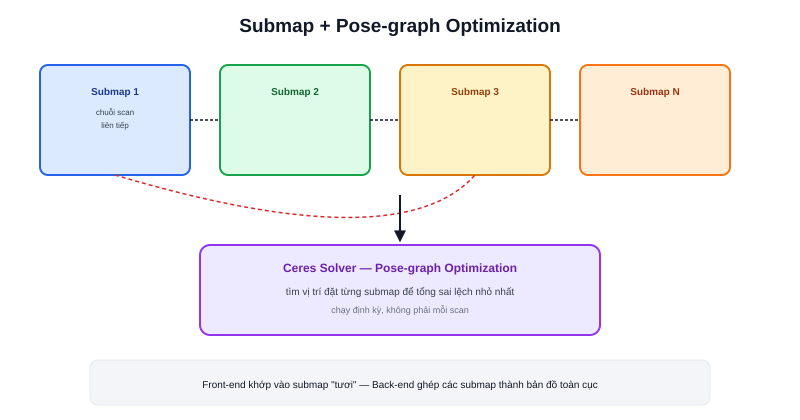

Bài [slam_toolbox](/blog/slam-toolbox) đã trình bày một lựa chọn SLAM linh hoạt. **Cartographer** — do Google phát triển — là lựa chọn còn lại phổ biến nhất trong ROS2, với kiến trúc nội bộ khác biệt rõ rệt: chia nhỏ bản đồ thành nhiều **submap**, thay vì khớp trực tiếp vào một bản đồ toàn cục duy nhất.



## Submap — chia để trị

```text
Thay vì: mỗi scan mới khớp trực tiếp vào MỘT bản đồ toàn cục khổng lồ
Cartographer: nhóm một chuỗi scan liên tiếp thành 1 "submap" cục bộ nhỏ
              khi đủ số scan, chốt submap đó lại, bắt đầu submap mới
```

Khớp scan vào một submap nhỏ, mới cập nhật gần đây chính xác và nhanh hơn nhiều so với khớp vào một bản đồ khổng lồ đã tích luỹ sai số qua thời gian dài — đây là lợi ích chính của kiến trúc chia nhỏ này.

## Pose-graph optimization — ghép các submap lại với nhau

Mỗi submap là một "đảo" độc lập — cần một bước riêng để ghép chúng thành bản đồ toàn cục nhất quán. Cartographer xây một **pose-graph**: mỗi submap là một node, các ràng buộc (constraint) giữa chúng — từ cả chuyển động liên tục lẫn loop closure (bài [SLAM là gì?](/blog/slam-la-gi)) — là các cạnh. Bộ giải tối ưu **Ceres Solver** (thư viện tối ưu phi tuyến của Google) tìm vị trí đặt từng submap sao cho tổng sai lệch giữa tất cả các ràng buộc là nhỏ nhất.

```text
Front-end: khớp scan vào submap hiện tại (nhanh, cục bộ)
Back-end:  Ceres Solver tối ưu vị trí TẤT CẢ submap cùng lúc (định kỳ, toàn cục)
```

Đúng khung Front-end/Back-end đã học ở bài SLAM là gì?, chỉ khác đơn vị xử lý là submap thay vì từng scan riêng lẻ.

> **Tóm lại:** Chia nhỏ thành submap giúp front-end luôn khớp vào dữ liệu "tươi", ít sai số tích luỹ — nhưng đổi lại cần thêm bước ghép nối (pose-graph optimization) phức tạp hơn để đảm bảo các submap khớp đúng với nhau ở quy mô toàn cục. Đây chính là sự đánh đổi kiến trúc cốt lõi phân biệt Cartographer với các hệ SLAM khớp trực tiếp vào một bản đồ duy nhất.

## Nhiều tham số hơn, cần tinh chỉnh kỹ hơn

So với slam_toolbox, Cartographer expose nhiều tham số cấu hình hơn (kích thước submap, ngưỡng chấp nhận constraint, trọng số trong hàm tối ưu Ceres...) — mạnh mẽ khi tinh chỉnh đúng cho một loại cảm biến/môi trường cụ thể, nhưng đòi hỏi hiểu sâu hơn để đạt kết quả tốt so với việc dùng slam_toolbox gần như "cắm là chạy" với tham số mặc định.

## Bảng so sánh nhanh với slam_toolbox

| Tiêu chí | Cartographer | slam_toolbox |
|---|---|---|
| Kiến trúc | Submap + pose-graph (Ceres Solver) | Pose-graph trực tiếp (không chia submap) |
| Độ phức tạp tham số | Cao, cần tinh chỉnh kỹ | Thấp hơn, dễ tiếp cận |
| Lifelong mapping | Không có sẵn | Có |
| Chế độ Localization riêng | Không | Có |
| Phù hợp | Cần độ chính xác cao, đã quen tinh chỉnh | Cần vòng lặp phát triển nhanh, linh hoạt |
