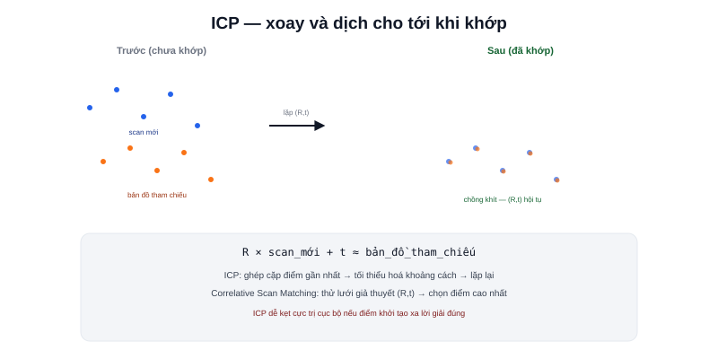

Bài [SLAM là gì?](/blog/slam-la-gi) gọi front-end là "scan matching" — khớp scan hiện tại với bản đồ đã có. Với LiDAR cụ thể, "khớp" nghĩa là gì? Bài này mở cơ chế đó ra ở mức thuật toán.



## Bài toán: tìm phép biến đổi khớp hai đám mây điểm

Mỗi lần quét LiDAR cho ra một tập điểm (point cloud) — toạ độ các vật thể phản xạ tia laser trở về. Scan matching giải bài toán: tìm phép **rotation + translation** (đúng khái niệm [Transform](/blog/transform-va-phep-bien-doi-toa-do) đã học) sao cho khi áp phép biến đổi đó lên scan mới, nó **chồng khít nhất có thể** lên bản đồ/scan tham chiếu đã có.

```text
Tìm (R, t) sao cho: R × scan_mới + t ≈ bản_đồ_tham_chiếu
```

Phép biến đổi `(R, t)` tìm được chính là ước lượng thay đổi vị trí robot giữa hai lần quét — đây là cách scan matching "tính ra" vị trí, không cần dựa vào odometry bánh xe (dù thường dùng odometry làm điểm khởi tạo để thuật toán hội tụ nhanh hơn).

## ICP — thuật toán kinh điển nhất

**Iterative Closest Point (ICP)** là thuật toán scan matching cổ điển, ý tưởng lặp lại đơn giản:

```text
1. Với mỗi điểm trong scan mới, tìm điểm GẦN NHẤT tương ứng trong scan tham chiếu
2. Tính phép biến đổi (R, t) tối thiểu hoá tổng khoảng cách giữa các cặp điểm đó
3. Áp dụng (R, t), lặp lại bước 1 với vị trí điểm đã cập nhật
4. Dừng khi (R, t) hội tụ (thay đổi giữa các vòng lặp đủ nhỏ)
```

> **Tóm lại:** ICP giả định ban đầu về phép ghép cặp điểm gần đúng, rồi tinh chỉnh dần — giống cách xoay hai mảnh ghép hình cho tới khi vừa khít, không biết trước chính xác mảnh nào khớp mảnh nào ngay từ đầu. Nhược điểm: dễ **hội tụ sai** (kẹt vào một vị trí không phải tối ưu thực sự) nếu điểm khởi tạo quá xa lời giải đúng — đây là lý do luôn cần một ước lượng ban đầu tốt (thường từ odometry) trước khi chạy ICP.

## Correlative Scan Matching — cách tiếp cận khác, ít bị kẹt cực trị cục bộ hơn

Thay vì ghép cặp điểm rồi tinh chỉnh dần (dễ kẹt cực trị cục bộ như ICP), phương pháp này quét thử một **lưới các giả thuyết** `(R, t)` khả dĩ trong một phạm vi tìm kiếm, chấm điểm mỗi giả thuyết bằng độ khớp với bản đồ, chọn giả thuyết điểm cao nhất. Cartographer (bài trước) dùng biến thể tối ưu hoá của phương pháp này — đánh đổi chi phí tính toán cao hơn (thử nhiều giả thuyết) lấy khả năng tránh kẹt cực trị cục bộ tốt hơn ICP thuần tuý.

## Vì sao độ phân giải góc LiDAR (đã nói ở bài Chọn LiDAR) ảnh hưởng trực tiếp scan matching

Bài [Chọn LiDAR](/blog/chon-lidar-cho-amr) đã nói độ phân giải góc ảnh hưởng khả năng phát hiện vật cản nhỏ — nó cũng ảnh hưởng trực tiếp chất lượng scan matching: mật độ điểm càng dày (độ phân giải góc càng mịn), thuật toán càng có nhiều dữ liệu để tìm đúng phép biến đổi khớp, đặc biệt quan trọng ở môi trường ít đặc trưng hình học rõ ràng (hành lang dài, tường phẳng trơn) — nơi scan matching dễ mất phương hướng nhất.
