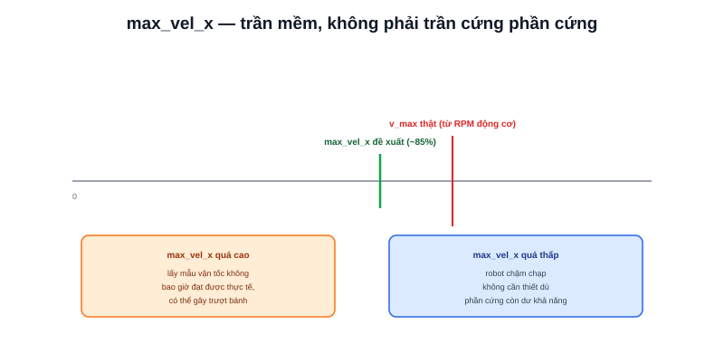

Bài [Controller](/blog/controller) đã giới thiệu DWB/MPPI lấy mẫu vận tốc trong "cửa sổ động". Cửa sổ đó bị giới hạn bởi các tham số vận tốc trong `params.yaml` — bài này đi vào cách đặt đúng các tham số đó.



## Các tham số chính

```yaml
FollowPath:
  plugin: "dwb_core::DWBLocalPlanner"
  max_vel_x: 0.3        # tốc độ tiến tối đa (m/s)
  min_vel_x: -0.1        # tốc độ lùi tối đa (âm = lùi)
  max_vel_theta: 1.0     # tốc độ xoay tối đa (rad/s)
  min_speed_xy: 0.0      # tốc độ tối thiểu để coi là "đang di chuyển"
```

## Không đặt cao hơn giới hạn vật lý thật

```text
max_vel_x KHÔNG được vượt quá v_max đã tính ở bài Chọn Motor:
    v_max = ω × r (từ RPM động cơ và bán kính bánh)
```

Đặt `max_vel_x` cao hơn tốc độ vật lý thật động cơ có thể đạt không làm robot nhanh hơn — nó chỉ khiến DWB/MPPI lấy mẫu những vận tốc không bao giờ đạt được thực tế, lãng phí một phần không gian tìm kiếm cho các mẫu vô nghĩa. Nên đặt `max_vel_x` **thấp hơn một chút** (khoảng 80-90%) so với `v_max` lý thuyết, chừa biên độ cho driver/pin không đạt đúng 100% hiệu năng danh nghĩa trong điều kiện thực tế (đã nhắc ở bài [Tính Battery](/blog/tinh-battery-cho-amr) — pin yếu dần theo thời gian sử dụng).

> **Tóm lại:** `max_vel_x` là trần tốc độ **mềm** áp cho thuật toán điều khiển, không phải trần tốc độ **cứng** của phần cứng — đặt sai theo hướng nào cũng có vấn đề: quá cao lãng phí không gian tìm kiếm hoặc gây trượt bánh khi driver cố ép đạt tốc độ không khả thi; quá thấp làm robot chậm chạp không cần thiết dù phần cứng còn dư khả năng.

## min_speed_xy — ngưỡng phân biệt "đang chạy" và "đứng yên"

Giá trị này ảnh hưởng tới cách một số recovery behavior (bài [Recovery](/blog/recovery)) và logic phát hiện "robot bị kẹt" (oscillation detection) hoạt động — đặt quá cao khiến hệ thống nghĩ robot đang đứng yên dù thực tế đang di chuyển chậm, kích hoạt recovery không cần thiết.

## Vận tốc khác nhau cho từng tình huống — không chỉ 1 bộ số cố định

Nhiều triển khai Nav2 thực tế dùng **nhiều profile tốc độ** khác nhau, chuyển đổi động theo ngữ cảnh (qua service `SetSpeedLimit` hoặc thay đổi tham số runtime):

```text
Không gian rộng, ít vật cản → tốc độ cao (gần max_vel_x tối đa)
Không gian hẹp, gần con người → tốc độ giảm chủ động (an toàn hơn tốc độ)
Đang docking/căn chỉnh chính xác → tốc độ rất thấp (ưu tiên độ chính xác)
```

```bash
ros2 topic pub /speed_limit nav2_msgs/msg/SpeedLimit "{speed_limit: 0.5, percentage: true}"
```

Đây là mức tinh chỉnh nâng cao hơn việc chỉ đặt một con số `max_vel_x` cố định trong `params.yaml` — phù hợp khi robot vận hành trong môi trường có mật độ người/vật cản thay đổi theo khu vực hoặc thời điểm trong ngày.
