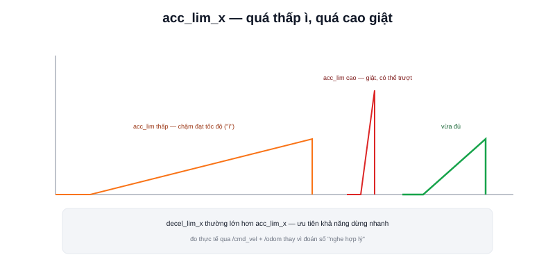

Bài [Giới hạn gia tốc](/blog/gioi-han-gia-toc-trong-dieu-khien-robot) đã giải thích trapezoidal velocity profile và công thức `v(t) = v(t-1) + clamp(..., -a_max·dt, +a_max·dt)`. Trong Nav2, `a_max` chính là hai tham số `acc_lim_x`/`decel_lim_x`.



## Tham số chính

```yaml
FollowPath:
  acc_lim_x: 1.0       # gia tốc tuyến tính tối đa (m/s²)
  decel_lim_x: -1.5     # giảm tốc tối đa (thường cho phép lớn hơn acc_lim_x)
  acc_lim_theta: 2.0    # gia tốc góc tối đa (rad/s²)
```

## Vì sao decel thường cho phép lớn hơn acc

```text
acc_lim_x (tăng tốc):  bị giới hạn bởi mô-men động cơ thực tế có thể tạo ra
decel_lim_x (giảm tốc): có thể tận dụng thêm ma sát + phanh động cơ,
                         thường có biên độ lớn hơn tăng tốc chủ động
```

Nhiều cấu hình thực tế đặt `decel_lim_x` (trị tuyệt đối) lớn hơn `acc_lim_x` một chút — robot giảm tốc nhanh hơn khi tăng tốc, hợp lý về mặt an toàn (ưu tiên khả năng dừng nhanh hơn khả năng tăng tốc nhanh) và thường khả thi hơn về mặt cơ khí.

> **Tóm lại:** `acc_lim_x` quá thấp khiến robot "ì" — mất nhiều thời gian đạt tốc độ mong muốn sau mỗi lần dừng/rẽ, tổng thời gian hoàn thành nhiệm vụ tăng dù `max_vel_x` (bài trước) đặt đủ cao. `acc_lim_x` quá cao khiến controller ra lệnh đổi tốc độ nhanh hơn khả năng thực tế của động cơ/driver đáp ứng — driver có thể bị quá tải dòng tức thời (đã nhắc ở bài [Motor Driver](/blog/motor-driver-cho-amr)) hoặc gây trượt bánh làm sai lệch odometry.

## Đo thực tế thay vì đoán

Cách xác định `acc_lim_x` hợp lý cho robot cụ thể: dùng `ros2 topic pub` gửi thẳng các mức `/cmd_vel` tăng dần, quan sát qua encoder xem robot đạt tốc độ đích trong bao lâu mà không trượt bánh — đây chính là phép đo gia tốc thực tế đạt được, dùng làm cơ sở đặt `acc_lim_x` thay vì chọn một con số "nghe hợp lý" không có căn cứ.

```bash
ros2 topic pub /cmd_vel geometry_msgs/msg/Twist "{linear: {x: 0.3}}" --once
ros2 topic echo /odom   # quan sát tốc độ thực tế tăng dần theo thời gian
```

## Ảnh hưởng qua lại với Costmap và Controller

Gia tốc thấp làm robot phản ứng chậm hơn với vật cản mới xuất hiện (thời gian từ lúc quyết định giảm tốc tới lúc thực sự chậm lại kéo dài hơn) — cần cân nhắc cùng với `inflation_radius` (bài [Costmap](/blog/costmap)): robot gia tốc/giảm tốc chậm nên có vùng đệm an toàn (inflation) rộng hơn để bù lại thời gian phản ứng chậm đó.
