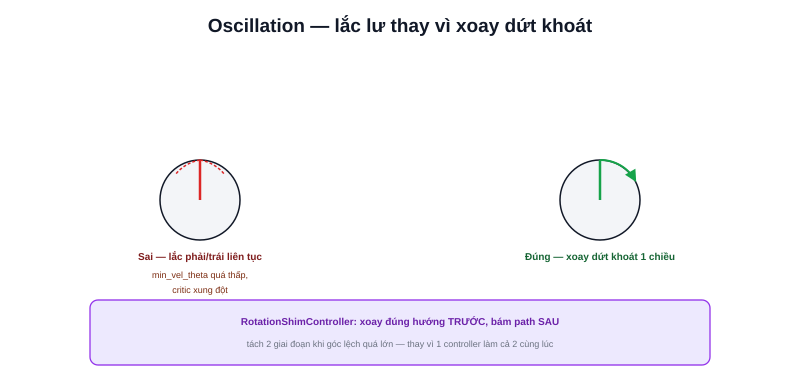

Bài [Tuning Velocity](/blog/tuning-velocity) đã nói `max_vel_theta`. Riêng chuyển động xoay có một vài tham số và hiện tượng đặc thù đáng bàn kỹ hơn — đặc biệt là hiện tượng "lắc lư" (oscillation) khi robot cố xoay vào đúng hướng.



## Hiện tượng lắc lư (Oscillation) khi xoay tại chỗ

```text
Triệu chứng: robot xoay phải một chút, rồi xoay trái một chút, lặp lại
             liên tục thay vì xoay dứt khoát một chiều tới đích
```

Nguyên nhân phổ biến: `min_vel_theta` (tốc độ xoay tối thiểu) đặt quá gần 0, hoặc trọng số các critic (đã học ở bài [Controller](/blog/controller)) liên quan tới hướng (`GoalAlign`, `PathAlign`) xung đột nhau, khiến DWB liên tục đổi ý giữa "xoay phải một chút tốt hơn" và "xoay trái một chút tốt hơn" ở mỗi chu kỳ tính toán mới.

```yaml
FollowPath:
  min_vel_theta: 0.15    # đặt đủ lớn để tránh xoay "nhấp nhả" gần 0
  Oscillation.scale: 5.0  # tăng phạt cho hành vi đổi chiều liên tục
```

## Rotation Shim Controller — xoay trước, di chuyển sau

```text
Vấn đề: robot vi sai lệch hướng lớn so với path (ví dụ vừa quay đầu 90°)
        DWB cố vừa tiến vừa xoay cùng lúc → quỹ đạo cong bất thường,
        không hiệu quả khi lệch hướng quá lớn
```

Nav2 cung cấp `RotationShimController` — plugin trung gian, khi phát hiện góc lệch giữa hướng robot và hướng path vượt ngưỡng, **ưu tiên xoay tại chỗ trước** cho tới khi hướng gần khớp, rồi mới chuyển giao cho controller chính (DWB/MPPI) xử lý tiến/lùi bám path bình thường:

```yaml
controller_server:
  ros__parameters:
    controller_plugins: ["FollowPath"]
    FollowPath:
      plugin: "nav2_rotation_shim_controller::RotationShimController"
      primary_controller: "dwb_core::DWBLocalPlanner"
      rotate_to_heading_angular_vel: 1.8
      max_angular_accel: 3.2
```

> **Tóm lại:** Rotation Shim tách rõ hai giai đoạn — "xoay đúng hướng" và "di chuyển bám path" — thay vì để một controller duy nhất cố làm cả hai cùng lúc khi góc lệch quá lớn. Đây là giải pháp cấu hình (đổi plugin), không phải chỉnh tham số đơn thuần như các bài khác trong chuyên mục này.

## acc_lim_theta ảnh hưởng tới độ "dứt khoát" khi xoay

Giống `acc_lim_x` (bài trước) nhưng cho chuyển động góc — `acc_lim_theta` quá thấp khiến robot xoay ì ạch, chậm đạt `max_vel_theta`, càng dễ bị cảm giác "lắc lư" nếu path yêu cầu đổi hướng liên tục trong khoảng cách ngắn (ví dụ đi qua khu vực nhiều góc cua gấp).

## Bảng debug nhanh

| Triệu chứng | Kiểm tra |
|---|---|
| Lắc lư qua lại khi xoay tại chỗ | `min_vel_theta`, `Oscillation.scale` |
| Quỹ đạo cong bất thường khi vừa quay đầu | Cân nhắc `RotationShimController` |
| Xoay chậm, ì | `acc_lim_theta`, `max_vel_theta` |
