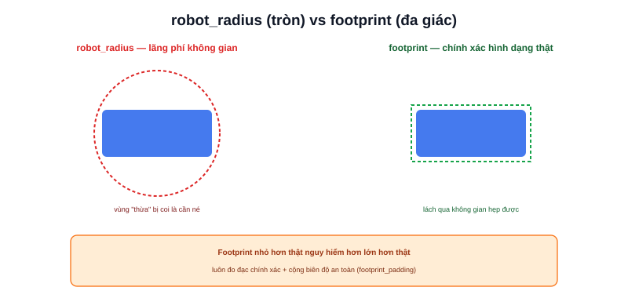

Bài [Costmap](/blog/costmap) đã nói Inflation Layer cần bán kính robot để tính chi phí lan toả quanh vật cản. Tham số đó tới từ đâu — **footprint** — là chủ đề bài này.



## Hai cách khai báo hình dạng robot

```yaml
local_costmap:
  local_costmap:
    ros__parameters:
      # Cách 1: hình tròn đơn giản
      robot_radius: 0.22

      # Cách 2: đa giác chính xác (dùng thay vì robot_radius, không dùng cả 2)
      footprint: "[[0.2, 0.15], [0.2, -0.15], [-0.2, -0.15], [-0.2, 0.15]]"
```

- **`robot_radius`** — coi robot như một hình tròn, đơn giản, tính toán nhanh, nhưng **lãng phí không gian** nếu robot thực tế không tròn (ví dụ robot hình chữ nhật dài — hình tròn bao trọn nó sẽ rộng hơn nhiều so với kích thước thật theo chiều ngang)
- **`footprint`** — đa giác khai chính xác từng điểm góc robot, phản ánh đúng hình dạng thật, cho phép robot lách qua không gian hẹp mà hình tròn bao ngoài sẽ từ chối đi qua

> **Tóm lại:** `robot_radius` phù hợp robot gần tròn hoặc gần vuông (Mecanum, differential có tỉ lệ dài/rộng gần 1) — đơn giản, đủ dùng. `footprint` cần thiết khi robot có hình dạng dài/lệch rõ rệt (robot chở pallet, robot có tay máy nhô ra một bên) — nếu dùng `robot_radius` cho robot dài, costmap sẽ coi cả phần "thừa" không có robot là cần né tránh, khiến robot không lách được qua không gian đủ rộng thực tế.

## Footprint sai gây ra hai loại lỗi ngược nhau

```text
Footprint LỚN hơn robot thật:
  → robot từ chối đi qua không gian hẹp mà thực tế đủ rộng
  → planner tính đường vòng không cần thiết, hoặc báo "không tìm được đường"

Footprint NHỎ hơn robot thật:
  → robot tính đường đi sát vật cản hơn kích thước thật cho phép
  → nguy cơ va chạm thực tế dù Nav2 "nghĩ" là an toàn
```

Footprint nhỏ hơn thực tế nguy hiểm hơn nhiều so với lớn hơn — luôn nên đo đạc chính xác kích thước vật lý robot (kể cả các phần nhô ra như bumper, cảm biến gắn cạnh) rồi cộng thêm một biên độ an toàn nhỏ, không nên "làm tròn xuống" để tiết kiệm không gian di chuyển.

## Padding — thêm biên độ an toàn không cần đo lại thủ công

```yaml
footprint_padding: 0.03    # thêm 3cm biên độ an toàn quanh footprint đã khai
```

Thay vì tự cộng thêm biên độ vào từng toạ độ điểm góc trong `footprint`, `footprint_padding` áp dụng biên độ đều quanh toàn bộ đa giác đã khai — tiện lợi khi muốn điều chỉnh mức độ "thận trọng" mà không cần tính lại toạ độ từng điểm.

## Local costmap và global costmap dùng chung 1 footprint

Không có khái niệm "footprint khác nhau cho local và global costmap" — hình dạng vật lý robot là một sự thật cố định, không đổi theo loại costmap (đã học ở bài Costmap) — chỉ có kích thước vùng phủ (3x3m cục bộ vs toàn bản đồ) là khác nhau giữa hai loại.
