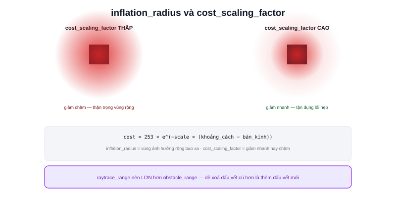

Bài [Costmap](/blog/costmap) đã giải thích Inflation Layer lan toả chi phí quanh vật cản. Đây là bài thực hành tinh chỉnh hai tham số quan trọng nhất của lớp này.



## inflation_radius — bán kính vùng ảnh hưởng

```yaml
inflation_layer:
  inflation_radius: 0.55   # mét
```

Đúng như đã nói ở bài Costmap: tối thiểu bằng bán kính robot (bài [Footprint](/blog/tuning-footprint)) cộng biên độ an toàn. Quá nhỏ, robot tính đường sát vật cản hơn mức an toàn thực tế cho phép; quá lớn, robot từ chối đi qua các không gian hẹp mà thực tế đủ rộng để lách qua.

## cost_scaling_factor — tốc độ giảm chi phí theo khoảng cách

```yaml
inflation_layer:
  cost_scaling_factor: 3.0
```

Công thức chi phí trong vùng inflation:

```text
cost = 253 × e^(-cost_scaling_factor × (khoảng_cách − bán_kính_vật_cản))
```

`cost_scaling_factor` càng **lớn**, chi phí giảm càng **nhanh** theo khoảng cách — robot "bớt thận trọng" nhanh hơn khi đi xa dần vật cản, sẵn sàng đi gần hơn. `cost_scaling_factor` càng **nhỏ**, chi phí giảm chậm, robot giữ khoảng cách "thận trọng" trên phạm vi rộng hơn quanh mỗi vật cản.

> **Tóm lại:** Hai tham số phối hợp nhau — `inflation_radius` quyết định vùng ảnh hưởng **rộng bao xa**, `cost_scaling_factor` quyết định độ "thận trọng" đó **giảm nhanh hay chậm** trong vùng đó. Môi trường đông đúc, nhiều người qua lại nên ưu tiên `cost_scaling_factor` thấp hơn (thận trọng lâu hơn); môi trường tĩnh, nhiều lối đi hẹp nên ưu tiên giá trị cao hơn (bớt thận trọng nhanh, tận dụng được không gian hẹp).

## obstacle_range và raytrace_range — tầm ảnh hưởng của dữ liệu cảm biến

```yaml
obstacle_layer:
  scan:
    obstacle_range: 2.5    # chỉ đánh dấu vật cản trong phạm vi này
    raytrace_range: 3.0    # xoá dấu vết vật cản cũ trong phạm vi này khi không còn thấy
```

- **`obstacle_range`** — giới hạn khoảng cách LiDAR được phép **thêm** ô "occupied" vào costmap — vật cản quá xa (dù LiDAR có tầm quét xa hơn, bài [Chọn LiDAR](/blog/chon-lidar-cho-amr)) không cần đánh dấu ngay, tránh costmap "quá tải" thông tin không cần thiết cho việc né tránh tức thời
- **`raytrace_range`** — giới hạn khoảng cách được phép **xoá** ô đã đánh dấu occupied trước đó nếu giờ tia laser đi xuyên qua không còn chạm gì — cơ chế "vật cản đã biến mất" (người đã đi qua chỗ đó)

Thường đặt `raytrace_range` **lớn hơn** `obstacle_range` — dễ xoá dấu vết cũ hơn là thêm dấu vết mới, tránh costmap "dính" mãi một vật cản động đã di chuyển đi từ lâu.

## Kiểm tra bằng RViz2

Đúng như đã học ở bài [RViz2](/blog/rviz2), thêm Display cho topic `/local_costmap/costmap` — quan sát trực tiếp vùng màu (chi phí) lan toả quanh vật cản khi thay đổi từng tham số, thay vì chỉ đoán bằng công thức lý thuyết. Đây là cách hiệu quả nhất để tune costmap: sửa tham số, xem ngay hiệu ứng trực quan trong RViz2, lặp lại.
