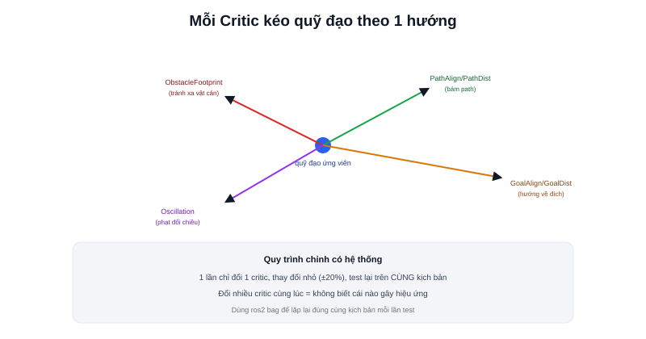

Bài [Controller](/blog/controller) đã giới thiệu các critic (`ObstacleFootprint`, `PathAlign`, `GoalAlign`...) chấm điểm quỹ đạo ứng viên trong DWB. Đây là bài cuối chuyên mục Tuning Nav2 — tổng hợp lại toàn bộ tham số đã học ở các bài trước thành một quy trình chỉnh sửa có hệ thống.



## Các critic phổ biến và ý nghĩa trọng số

```yaml
FollowPath:
  critics: ["ObstacleFootprint", "PathAlign", "GoalAlign", "PathDist", "GoalDist", "Oscillation"]
  ObstacleFootprint.scale: 0.02
  PathAlign.scale: 32.0
  GoalAlign.scale: 24.0
  PathDist.scale: 32.0
  GoalDist.scale: 24.0
```

```text
ObstacleFootprint — phạt quỹ đạo tiến gần vật cản (kết hợp với Costmap)
PathAlign          — thưởng quỹ đạo có HƯỚNG khớp với hướng path tại điểm gần nhất
PathDist            — thưởng quỹ đạo có VỊ TRÍ gần path
GoalAlign           — thưởng quỹ đạo hướng thẳng về goal cuối
GoalDist             — thưởng quỹ đạo tiến gần goal cuối
Oscillation          — phạt hành vi đổi chiều liên tục (đã nhắc ở bài Tuning Rotation)
```

Mỗi critic "kéo" lựa chọn quỹ đạo theo một hướng ưu tiên khác nhau — tổng điểm là tổ hợp có trọng số của tất cả, `scale` càng cao thì critic đó càng có tiếng nói quyết định.

## Quy trình chỉnh trọng số có hệ thống

```text
1. Bắt đầu với bộ trọng số mặc định của Nav2 (đã kiểm chứng rộng rãi)
2. Quan sát hành vi thực tế — ghi lại RÕ triệu chứng cụ thể
   (không phải "chạy chưa tốt" chung chung)
3. Xác định critic nào liên quan trực tiếp tới triệu chứng đó
4. Chỉ chỉnh MỘT critic một lần, thay đổi nhỏ (ví dụ ±20%)
5. Test lại, quan sát, lặp lại bước 3
```

> **Tóm lại:** Chỉnh nhiều critic cùng lúc là sai lầm phổ biến nhất — khi hành vi thay đổi, không thể biết chính xác critic nào gây ra hiệu ứng đó, dễ rơi vào vòng lặp thử-sai không có hệ thống. Luôn chỉnh một tham số, quan sát rõ ràng, rồi mới chuyển sang tham số tiếp theo — đúng nguyên tắc khoa học cơ bản khi thực nghiệm, không riêng gì Nav2.

## Bảng triệu chứng → critic liên quan

| Triệu chứng | Critic cần xem lại |
|---|---|
| Robot cắt góc, không bám sát path | Tăng `PathAlign.scale`, `PathDist.scale` |
| Robot đi quá sát vật cản | Tăng `ObstacleFootprint.scale`, hoặc xem lại `inflation_radius` (bài Tuning Costmap) |
| Robot ưu tiên bám path hơn cả khi path dẫn qua vùng nguy hiểm | Giảm `PathAlign.scale` tương đối so với `ObstacleFootprint.scale` |
| Lắc lư khi gần đích | Xem bài [Tuning Rotation](/blog/tuning-rotation), tăng `Oscillation.scale` |
| Chọn quỹ đạo "hợp lý" nhưng không tới đích nhanh nhất | Tăng `GoalDist.scale`, `GoalAlign.scale` |

## Test có kiểm soát: cùng một kịch bản mỗi lần

Để so sánh công bằng hiệu ứng của từng thay đổi tham số, nên test trên **cùng một kịch bản cố định** mỗi lần (cùng bản đồ, cùng điểm xuất phát, cùng điểm đích, lý tưởng nhất là dùng `ros2 bag` — bài [ros2 bag](/blog/ros2-bag) — ghi lại một kịch bản LiDAR/odometry thật rồi phát lại nhiều lần) — thay đổi môi trường test giữa các lần thử khiến không thể phân biệt được hiệu ứng do tham số mới hay do điều kiện môi trường khác đi.

## Đây là bước cuối trong chuỗi tinh chỉnh Nav2

Chuyên mục Tuning Nav2 đã đi qua đủ các tham số: [Velocity](/blog/tuning-velocity), [Acceleration](/blog/tuning-acceleration), [Rotation](/blog/tuning-rotation), [Footprint](/blog/tuning-footprint), [Costmap](/blog/tuning-costmap), và Controller (bài này) — đúng thứ tự nên tinh chỉnh khi triển khai Nav2 lên một robot thật: từ giới hạn vật lý cơ bản (velocity/acceleration/footprint phản ánh đúng phần cứng) tới các tham số hành vi tinh tế hơn (costmap, critic weights) chỉ nên chỉnh sau khi các giới hạn vật lý đã đúng.
