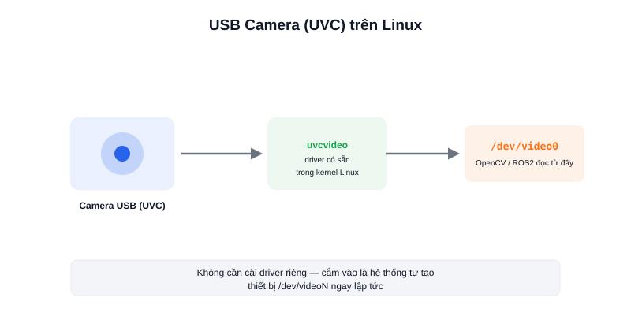

Muốn robot "nhìn thấy" thay vì chỉ đo khoảng cách như LiDAR, camera là cảm biến rẻ và linh hoạt nhất — nhận diện màu sắc, vật thể, mã vạch, hay chạy các mô hình AI thị giác. Loại camera dễ dùng nhất trên Linux/ROS2 là **USB Camera chuẩn UVC**.



## UVC là gì

**UVC (USB Video Class)** là một chuẩn giao tiếp USB chung cho thiết bị video — webcam, camera công nghiệp giá rẻ — được Linux hỗ trợ sẵn trong nhân hệ điều hành (kernel) thông qua driver `uvcvideo`. Nhờ vậy, hầu hết camera USB "cắm là chạy" trên Ubuntu mà không cần cài thêm driver riêng như nhiều thiết bị nhúng khác.

Khi cắm một camera UVC vào máy chạy Linux, hệ thống tự tạo ra thiết bị dạng `/dev/video0` (hoặc `/dev/video1`, `/dev/video2`... nếu có nhiều camera) — đây chính là điểm vào (interface) chuẩn mà cả công cụ dòng lệnh, OpenCV, lẫn gói ROS2 camera đều dùng để đọc khung hình.

### Kiểm tra nhanh camera đã nhận chưa

```bash
ls /dev/video*              # liệt kê các thiết bị camera đang có
v4l2-ctl --list-devices     # xem tên thiết bị ứng với từng /dev/videoN
```

## Vì sao chọn USB Camera cho robot DIY

- **Không cần driver riêng** — khác với nhiều cảm biến khác phải build driver từ mã nguồn, USB Camera UVC dùng driver có sẵn trong kernel Linux.
- **Giá rẻ, đa dạng lựa chọn** — từ webcam phổ thông vài trăm nghìn đến camera công nghiệp UVC độ phân giải cao.
- **Tương thích sẵn với hệ sinh thái ROS2** — gói `usb_cam` hoặc `v4l2_camera` đọc thẳng từ `/dev/videoN` và publish ra topic ROS2 chuẩn, sẵn sàng cho OpenCV hoặc các mô hình AI thị giác xử lý tiếp.

## Kết luận

USB Camera chuẩn UVC là điểm khởi đầu đơn giản nhất để thêm thị giác cho robot ROS2 — không tốn công cài driver, chi phí thấp, và có cả hệ sinh thái công cụ/gói ROS2 hỗ trợ sẵn. Bài tiếp theo đi sâu vào V4L2 — lớp giao tiếp phía dưới UVC mà Linux dùng để điều khiển camera.
