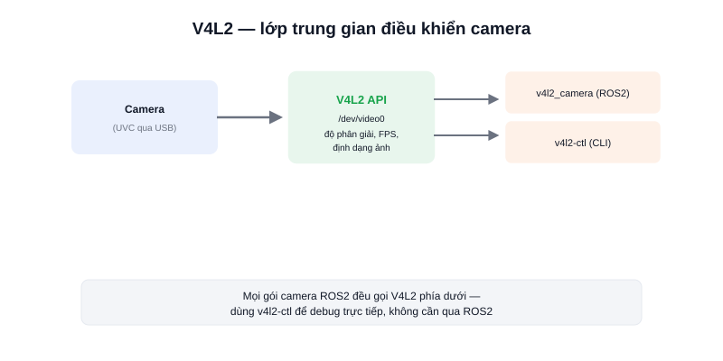

Bài trước nói về UVC — chuẩn giao tiếp USB cho camera. Nhưng thứ thực sự "nói chuyện" với camera ở tầng hệ điều hành là **V4L2 (Video4Linux2)** — một API của nhân Linux để điều khiển thiết bị video, dù camera đó kết nối qua USB (UVC) hay các giao tiếp khác.



## V4L2 làm gì

V4L2 cung cấp một tập lệnh chuẩn để ứng dụng (OpenCV, gói camera ROS2, hay công cụ dòng lệnh) cấu hình và đọc dữ liệu từ thiết bị `/dev/videoN`, bất kể camera là hãng nào — miễn tương thích V4L2 (hầu hết camera UVC đều tương thích sẵn).

Công cụ `v4l2-ctl` cho phép xem và chỉnh các thông số này trực tiếp từ dòng lệnh, hữu ích để kiểm tra trước khi viết code:

```bash
v4l2-ctl --list-devices                       # liệt kê camera đang cắm
v4l2-ctl -d /dev/video0 --list-formats-ext    # xem định dạng/độ phân giải/FPS hỗ trợ
v4l2-ctl -d /dev/video0 --set-fmt-video=width=640,height=480,pixelformat=MJPG
v4l2-ctl -d /dev/video0 -c brightness=128     # chỉnh độ sáng (tuỳ camera hỗ trợ)
```

### Vì sao cần biết V4L2 khi làm ROS2

Gói camera ROS2 phổ biến là **`v4l2_camera`** — đúng như tên gọi, nó gọi thẳng API V4L2 để đọc khung hình và publish ra topic ROS2 chuẩn (`sensor_msgs/Image`). Hiểu V4L2 giúp debug nhanh hơn khi camera không hoạt động đúng: kiểm tra bằng `v4l2-ctl` trước để biết vấn đề nằm ở phần cứng/driver hay ở code ROS2, thay vì đoán mò.

```bash
# Chạy node v4l2_camera, publish topic /image_raw
ros2 run v4l2_camera v4l2_camera_node --ros-args -p video_device:=/dev/video0
```

## Lỗi thường gặp

Camera hỗ trợ nhiều độ phân giải/FPS khác nhau nhưng không phải tổ hợp nào cũng hợp lệ — yêu cầu độ phân giải cao kèm FPS cao có thể vượt quá băng thông USB, khiến node báo lỗi hoặc hình bị giật. Luôn kiểm tra bằng `--list-formats-ext` trước để biết chính xác tổ hợp camera hỗ trợ.

## Kết luận

V4L2 là lớp điều khiển camera chuẩn của Linux mà mọi gói camera ROS2 đều dựa vào — nắm được `v4l2-ctl` giúp debug camera nhanh và chính xác hơn nhiều so với chỉ thử code ROS2 rồi đoán lỗi ở đâu.
