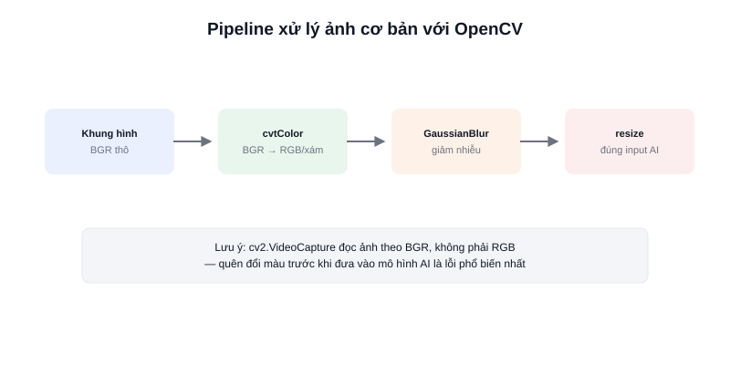

Trước khi robot "hiểu" được nó đang nhìn thấy gì (object detection, tracking...), khung hình thô từ camera thường cần qua vài bước xử lý cơ bản — đổi không gian màu, resize, làm mượt nhiễu. **OpenCV** là thư viện tiêu chuẩn cho việc này, được dùng gần như trong mọi pipeline thị giác robot.



## OpenCV làm gì trong pipeline thị giác

OpenCV (Open Source Computer Vision Library) cung cấp hàng trăm hàm xử lý ảnh đã được tối ưu, viết bằng C++ nhưng có binding Python đầy đủ — hầu hết code robot dùng bản Python (`cv2`) vì viết nhanh, dễ đọc, và tốc độ vẫn đủ tốt vì phần tính toán nặng chạy ở lõi C++ bên dưới.

```python
import cv2

cap = cv2.VideoCapture(0)          # mở camera tại /dev/video0
ret, frame = cap.read()            # đọc 1 khung hình (BGR, không phải RGB!)

gray = cv2.cvtColor(frame, cv2.COLOR_BGR2GRAY)   # chuyển sang ảnh xám
blurred = cv2.GaussianBlur(gray, (5, 5), 0)      # làm mượt, giảm nhiễu
resized = cv2.resize(frame, (640, 480))          # đổi kích thước cho mô hình AI

cv2.imshow("frame", frame)
cv2.waitKey(1)
```

### Một điểm hay gây nhầm: OpenCV đọc ảnh theo BGR, không phải RGB

Đây là lỗi phổ biến nhất với người mới — `cv2.imread`/`cv2.VideoCapture` trả về ảnh theo thứ tự kênh màu **BGR** thay vì RGB quen thuộc. Nếu đưa thẳng vào mô hình AI được huấn luyện trên ảnh RGB mà không chuyển đổi, kết quả nhận diện sẽ sai lệch dù code chạy không báo lỗi gì.

```python
rgb_frame = cv2.cvtColor(frame, cv2.COLOR_BGR2RGB)  # chuyển đúng trước khi đưa vào mô hình
```

## Các thao tác tiền xử lý thường gặp

| Thao tác | Hàm OpenCV | Mục đích |
|---|---|---|
| Đổi không gian màu | `cv2.cvtColor()` | BGR↔RGB, hoặc sang HSV để lọc theo màu |
| Làm mượt/giảm nhiễu | `cv2.GaussianBlur()` | Giảm nhiễu hạt trước khi phát hiện cạnh/vật thể |
| Resize | `cv2.resize()` | Đưa về đúng kích thước input mô hình AI yêu cầu |
| Phát hiện cạnh | `cv2.Canny()` | Tìm biên vật thể, dùng trong các thuật toán cổ điển |

## Kết luận

OpenCV là nền tảng xử lý ảnh mà hầu hết pipeline thị giác robot đều đi qua trước khi tới bước AI — nắm vững các thao tác cơ bản (đổi màu, resize, làm mượt) và nhớ kỹ vụ BGR/RGB sẽ tránh được phần lớn lỗi "mô hình chạy nhưng kết quả sai" khi mới bắt đầu.
