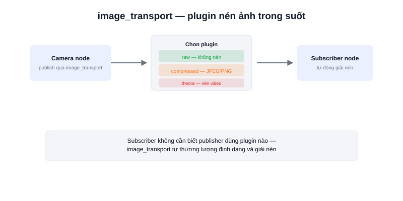

Một khung hình camera 640×480 chưa nén (raw) nặng gần 1MB — publish liên tục 30 khung hình/giây qua topic ROS2 thông thường có thể chiếm băng thông đáng kể, nhất là khi truyền qua mạng giữa nhiều máy tính trong cùng một AMR. Gói **`image_transport`** giải quyết vấn đề này.



## Vấn đề với topic ảnh thông thường

Nếu publish ảnh bằng `sensor_msgs/Image` qua topic ROS2 bình thường (`rclpy.Publisher`), dữ liệu luôn ở dạng thô — mỗi khung hình gửi đi không hề nén, dù có bao nhiêu subscriber lắng nghe. Với robot chạy nhiều node trên nhiều máy tính khác nhau (VD: 1 máy xử lý camera, 1 máy chạy giao diện giám sát), băng thông mạng nội bộ nhanh chóng trở thành nút thắt cổ chai.

## image_transport hoạt động ra sao

`image_transport` cung cấp một lớp API tương tự publisher/subscriber thông thường, nhưng cho phép chọn **plugin truyền tải** khác nhau — phổ biến nhất là:

- **raw** — không nén, giống publish thông thường (mặc định).
- **compressed** — nén JPEG/PNG, giảm đáng kể kích thước dữ liệu truyền qua mạng.
- **theora** — nén video, tối ưu cho luồng ảnh liên tục.

Điểm hay là **subscriber không cần biết publisher đang dùng plugin nào** — `image_transport` tự thương lượng định dạng, giải nén trong suốt trước khi trả ảnh về cho code người dùng.

```python
# Publisher (C++ thường dùng cho tốc độ, nhưng ý tưởng giống Python)
image_transport::ImageTransport it(node);
image_transport::Publisher pub = it.advertise("camera/image", 1);
pub.publish(cv_bridge::CvImage(header, "bgr8", frame).toImageMsg());
```

```bash
# Xem các topic ảnh + biến thể nén mà image_transport tạo ra
ros2 topic list | grep image
# camera/image
# camera/image/compressed
# camera/image/compressedDepth (nếu có depth camera)
```

## Khi nào cần dùng

Nếu camera và node xử lý ảnh (OpenCV, YOLO...) chạy trên **cùng một máy tính**, dùng `raw` là đơn giản nhất — không có chi phí nén/giải nén thừa. Chỉ cần chuyển sang `compressed` khi ảnh phải truyền qua mạng tới máy khác, ví dụ gửi hình ảnh camera robot về giao diện giám sát trên PC ở xa.

## Kết luận

`image_transport` tách biệt việc "gửi ảnh" khỏi "cách nén ảnh" — giúp chuyển đổi giữa raw và các định dạng nén mà không phải sửa lại code xử lý ảnh ở phía subscriber, một tiện ích nhỏ nhưng quan trọng khi hệ thống robot có nhiều node chạy phân tán.
