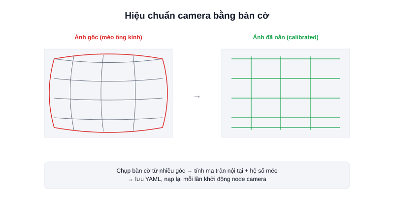

Ảnh chụp qua ống kính không bao giờ hoàn toàn "thẳng" — đường thẳng trong thực tế có thể hơi cong trên ảnh, đặc biệt ở camera góc rộng. Với ứng dụng chỉ cần nhận diện vật thể, sai lệch nhỏ này thường không đáng kể. Nhưng khi cần **đo khoảng cách hoặc kích thước thật** từ ảnh (stereo vision, AR marker, SLAM bằng camera), sai lệch này phải được hiệu chỉnh — đó là mục đích của **Camera Calibration**.



## Camera Calibration tìm ra điều gì

Quá trình hiệu chuẩn tính ra 2 nhóm tham số:

- **Ma trận nội tại (intrinsic matrix)** — tiêu cự (focal length) và tâm quang học (optical center) của chính ống kính, đặc trưng riêng cho từng camera.
- **Hệ số méo (distortion coefficients)** — mô tả độ cong do ống kính gây ra (méo hình thùng/gối thường gặp ở camera góc rộng), dùng để "nắn" ảnh về đúng hình học thật.

Có tham số này, phần mềm có thể chuyển đổi qua lại giữa toạ độ pixel trên ảnh và toạ độ thực trong không gian — nền tảng bắt buộc cho stereo vision (ước lượng độ sâu từ 2 camera) hay các thuật toán SLAM dùng camera.

## Cách hiệu chuẩn thực tế với ROS2

Cách phổ biến nhất là in một **bàn cờ (checkerboard)** kích thước ô vuông đã biết trước, chụp nó từ nhiều góc độ khác nhau, rồi để công cụ tự tính toán tham số dựa trên các góc bàn cờ phát hiện được trên từng ảnh.

```bash
# Gói camera_calibration chuẩn của ROS2
ros2 run camera_calibration cameracalibrator \
  --size 8x6 --square 0.024 \
  --ros-args -r image:=/camera/image_raw
```

- `--size 8x6` — số góc trong (không phải số ô vuông) theo chiều ngang×dọc của bàn cờ.
- `--square 0.024` — kích thước cạnh mỗi ô vuông tính bằng mét, phải đo chính xác bằng thước.

Công cụ sẽ yêu cầu di chuyển bàn cờ qua nhiều vị trí/góc nghiêng khác nhau trong khung hình cho đến khi đủ dữ liệu, sau đó xuất ra file YAML chứa ma trận nội tại và hệ số méo — file này được nạp lại mỗi lần khởi động node camera để tự động nắn ảnh.

## Khi nào thực sự cần hiệu chuẩn

Nếu chỉ dùng camera để nhận diện vật thể (object detection) hoặc theo dõi (tracking) mà không cần đo khoảng cách/kích thước chính xác, có thể bỏ qua bước này. Hiệu chuẩn trở nên cần thiết khi: dùng stereo camera để tính độ sâu, dùng AR marker để định vị, hoặc chạy visual SLAM.

## Kết luận

Camera Calibration là bước chuẩn bị một lần cho mỗi camera, không phải làm lại mỗi lần chạy — nhưng bắt buộc phải có nếu ứng dụng cần suy ra khoảng cách hoặc kích thước thật từ ảnh, thay vì chỉ nhận diện "có vật gì đó trong khung hình".
