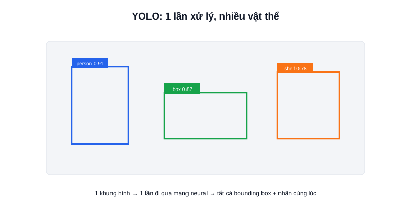

Khi robot cần "nhìn thấy và gọi tên" vật thể xung quanh — người, hộp hàng, chướng ngại vật — theo thời gian thực, **YOLO (You Only Look Once)** gần như là lựa chọn đầu tiên được nhắc tới trong cộng đồng robot/AI. Đây là một họ mô hình object detection nổi tiếng vì tốc độ xử lý nhanh, đủ để chạy thời gian thực ngay cả trên máy tính nhúng.



## Ý nghĩa cái tên "You Only Look Once"

Các phương pháp object detection đời trước thường phải quét ảnh nhiều lần với nhiều cửa sổ (sliding window) ở nhiều kích thước khác nhau để tìm vật thể — chậm và tốn tài nguyên. YOLO thay đổi cách tiếp cận: xử lý **toàn bộ khung hình chỉ trong một lần** đi qua mạng neural, trả về đồng thời vị trí (bounding box) và nhãn của tất cả vật thể phát hiện được — đây chính là lý do YOLO nhanh hơn nhiều phương pháp cũ và phù hợp cho ứng dụng thời gian thực như robot.

## Đầu ra của YOLO

Với mỗi vật thể phát hiện được, YOLO trả về:

- **Bounding box** — toạ độ khung chữ nhật bao quanh vật thể (x, y, width, height).
- **Class (nhãn)** — tên loại vật thể (người, xe, hộp...), tuỳ theo tập dữ liệu mô hình được huấn luyện.
- **Confidence score** — độ tin cậy của dự đoán, từ 0 đến 1.

```python
from ultralytics import YOLO

model = YOLO("yolov8n.pt")       # bản "nano" — nhẹ, phù hợp máy tính nhúng
results = model("frame.jpg")

for box in results[0].boxes:
    print(box.cls, box.conf, box.xyxy)   # nhãn, độ tin cậy, toạ độ box
```

## Chọn phiên bản phù hợp với máy tính nhúng

YOLO có nhiều phiên bản (v5, v8, v11...) và mỗi phiên bản lại có nhiều kích thước mô hình (nano, small, medium, large) — mô hình càng lớn càng chính xác nhưng càng chậm. Với máy tính nhúng như Jetson Orin Nano hay Raspberry Pi, bản **nano/small** thường là lựa chọn hợp lý để cân bằng giữa độ chính xác và tốc độ xử lý thời gian thực; máy có GPU (như Jetson) tận dụng được CUDA để chạy nhanh hơn đáng kể so với chỉ chạy trên CPU.

## Kết luận

YOLO là công cụ mạnh để robot nhận diện nhiều vật thể cùng lúc theo thời gian thực — hai bài tiếp theo trong chuyên mục đi sâu vào khái niệm Object Detection nói chung và cách tích hợp YOLO vào một pipeline ROS2 hoàn chỉnh.
