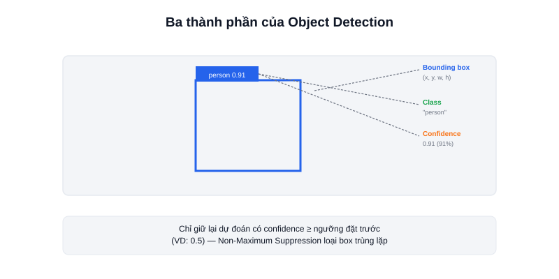

**Object Detection** (phát hiện vật thể) là bài toán thị giác máy tính trả lời đồng thời hai câu hỏi: **có vật gì** trong ảnh, và **vật đó nằm ở đâu** — khác với bài toán đơn giản hơn là *Image Classification* (chỉ trả lời "ảnh này thuộc loại gì" mà không cần biết vị trí).



## Ba khái niệm cốt lõi

- **Bounding box** — khung chữ nhật nhỏ nhất bao quanh vật thể, thường biểu diễn bằng toạ độ góc trên-trái và kích thước (x, y, width, height), hoặc toạ độ 2 góc chéo nhau (x1, y1, x2, y2).
- **Class (nhãn/lớp)** — tên loại vật thể được phát hiện, giới hạn trong tập các lớp mà mô hình được huấn luyện để nhận diện (VD: mô hình huấn luyện trên bộ dữ liệu COCO nhận diện được 80 lớp phổ biến như người, xe, ghế...).
- **Confidence score** — một số từ 0 đến 1 thể hiện mô hình "tự tin" thế nào với dự đoán đó. Ứng dụng thực tế luôn đặt một **ngưỡng (threshold)**, ví dụ chỉ giữ lại kết quả có confidence ≥ 0.5, để loại bỏ các dự đoán không chắc chắn.

## Vì sao một vật thể đôi khi bị nhận 2 box chồng nhau

Mô hình detection thường tạo ra nhiều đề xuất bounding box cho cùng một vật thể trước khi lọc — kỹ thuật **Non-Maximum Suppression (NMS)** được dùng để loại bỏ các box trùng lặp, chỉ giữ lại box có confidence cao nhất trong nhóm các box chồng lấn nhiều lên nhau. Hầu hết framework (như YOLO) đã tích hợp sẵn NMS, không cần tự viết.

```python
# Ví dụ kết quả detection dạng đơn giản hoá
detections = [
    {"class": "person", "confidence": 0.91, "box": [140, 130, 250, 280]},
    {"class": "box",    "confidence": 0.87, "box": [320, 180, 480, 270]},
]

for d in detections:
    if d["confidence"] >= 0.5:   # lọc theo ngưỡng tin cậy
        print(f'{d["class"]}: {d["confidence"]:.2f} tại {d["box"]}')
```

## Ứng dụng trong robot

Với AMR, object detection thường dùng để phát hiện người/vật cản động (bổ sung cho LiDAR — camera nhận diện được *loại* vật thể mà LiDAR không biết), hoặc để nhận diện mã kiện hàng/vị trí đỗ trong kho.

## Kết luận

Nắm vững ba khái niệm bounding box, class, và confidence là đủ để đọc hiểu và sử dụng bất kỳ mô hình object detection nào (YOLO hay các họ mô hình khác) — bài tiếp theo mở rộng sang Object Tracking, khi cần theo dõi cùng một vật thể qua nhiều khung hình liên tiếp.
