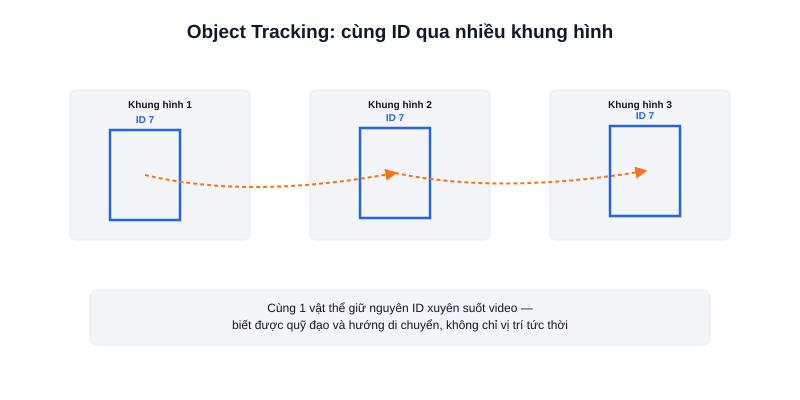

Object Detection (bài trước) trả lời "khung hình này có vật gì, ở đâu" — nhưng chạy detection độc lập trên từng khung hình không cho biết **vật thể ở khung hình này có phải cùng một vật với khung hình trước hay không**. Đó là vấn đề **Object Tracking** giải quyết: gán một ID cho mỗi vật thể và theo dõi ID đó xuyên suốt video.



## Vì sao không thể chỉ chạy detection mỗi khung hình

Chạy detection độc lập trên từng khung hình có hai vấn đề: **tốn tài nguyên tính toán** (mô hình detection thường nặng hơn nhiều so với thuật toán tracking), và **không biết được chuyển động** — ví dụ không thể tính vật thể đang di chuyển hướng nào, nhanh hay chậm, nếu mỗi khung hình đều coi là vật thể mới hoàn toàn.

## Cách tracking hoạt động (khái quát)

Cách phổ biến nhất là kết hợp: chạy detection để tìm vật thể ở một số khung hình, sau đó dùng thuật toán tracking nhẹ hơn (như dựa trên vị trí dự đoán, đặc trưng hình ảnh, hoặc bộ lọc Kalman) để "theo" vật thể đó ở các khung hình tiếp theo mà không cần chạy lại detection đầy đủ mỗi lần — chỉ chạy detection lại định kỳ hoặc khi tracking bị mất dấu vật thể.

```python
from ultralytics import YOLO

model = YOLO("yolov8n.pt")

# .track() thay vì .predict() — tự động gán và duy trì ID xuyên suốt video
results = model.track(source="video.mp4", persist=True)

for r in results:
    for box in r.boxes:
        track_id = box.id        # ID duy nhất cho vật thể này, giữ nguyên qua các khung hình
        print(f"ID {track_id}: {box.cls} tại {box.xyxy}")
```

## Ứng dụng trong robot

Với AMR, tracking hữu ích khi cần theo dõi một người cụ thể (robot đi theo người - "person following"), đếm số lượng vật thể đi qua một khu vực mà không đếm trùng, hoặc dự đoán hướng di chuyển của vật cản động để né tránh sớm hơn thay vì chỉ phản ứng khi vật cản đã ở gần.

## Kết luận

Object Tracking mở rộng Object Detection từ "nhận diện từng khung hình riêng lẻ" thành "theo dõi liên tục theo thời gian" — nền tảng cho các hành vi robot phức tạp hơn như đi theo người hoặc dự đoán chuyển động vật cản. Bài cuối trong chuyên mục này ghép YOLO vào một pipeline ROS2 hoàn chỉnh.
