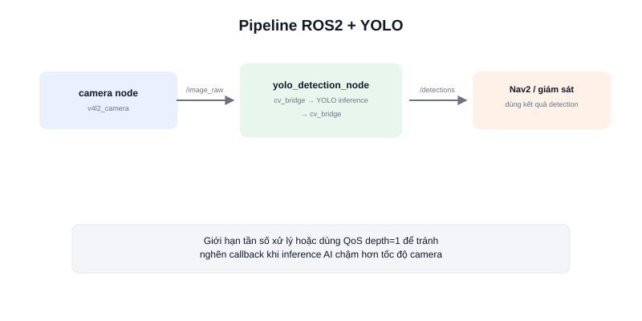

Chạy được YOLO độc lập trên một file ảnh/video là bước khởi đầu — nhưng để dùng thật trong robot, kết quả nhận diện cần trở thành một phần của hệ thống ROS2: đọc ảnh trực tiếp từ camera node, và publish kết quả ra topic để các node khác (Nav2 né vật cản động, node giám sát...) sử dụng được.



## Kiến trúc pipeline cơ bản

```text
camera node (v4l2_camera)  →  topic /image_raw
                                    │
                                    ▼
                         node YOLO detection (mới viết)
                                    │
                                    ▼
                    topic /detections (danh sách bounding box + nhãn)
```

Node YOLO đóng vai trò vừa là **subscriber** (nhận ảnh từ camera) vừa là **publisher** (gửi kết quả detection đi) — mẫu thiết kế phổ biến cho mọi node "xử lý rồi chuyển tiếp" trong ROS2.

## Viết node ROS2 chạy YOLO (rclpy)

```python
import rclpy
from rclpy.node import Node
from sensor_msgs.msg import Image
from cv_bridge import CvBridge
from ultralytics import YOLO

class YoloDetectionNode(Node):
    def __init__(self):
        super().__init__("yolo_detection_node")
        self.model = YOLO("yolov8n.pt")
        self.bridge = CvBridge()

        self.subscription = self.create_subscription(
            Image, "/image_raw", self.image_callback, 10
        )
        # Thực tế nên publish sensor_msgs/Image (đã vẽ box) hoặc
        # vision_msgs/Detection2DArray (dữ liệu có cấu trúc) thay vì tự định nghĩa
        self.publisher = self.create_publisher(Image, "/detections/image", 10)

    def image_callback(self, msg):
        frame = self.bridge.imgmsg_to_cv2(msg, desired_encoding="bgr8")
        results = self.model(frame, verbose=False)

        annotated = results[0].plot()   # vẽ sẵn bounding box lên ảnh
        out_msg = self.bridge.cv2_to_imgmsg(annotated, encoding="bgr8")
        self.publisher.publish(out_msg)

def main():
    rclpy.init()
    node = YoloDetectionNode()
    rclpy.spin(node)

if __name__ == "__main__":
    main()
```

`cv_bridge` là gói chuyển đổi qua lại giữa ảnh dạng OpenCV (`numpy` array) và message ROS2 (`sensor_msgs/Image`) — cầu nối bắt buộc phải có mỗi khi xử lý ảnh ROS2 bằng OpenCV/mô hình AI.

## Lưu ý hiệu năng

Chạy inference AI trên mỗi khung hình camera (thường 30 khung hình/giây) có thể vượt quá khả năng xử lý của máy tính nhúng, gây tắc nghẽn (backlog) callback. Cách xử lý phổ biến: giới hạn tần số xử lý (VD: chỉ chạy YOLO mỗi 3-5 khung hình thay vì mọi khung hình), hoặc dùng `qos_profile` với `depth=1` để tự động bỏ qua khung hình cũ khi node xử lý không kịp, ưu tiên luôn xử lý khung hình mới nhất.

## Kết luận

Việc tích hợp YOLO vào ROS2 về bản chất chỉ là một node subscriber/publisher thông thường, với `cv_bridge` làm cầu nối giữa dữ liệu ảnh OpenCV và message ROS2. Điểm cần lưu ý nhất khi triển khai thực tế là quản lý hiệu năng — đảm bảo pipeline AI không làm nghẽn các node khác đang cần dữ liệu thời gian thực.
