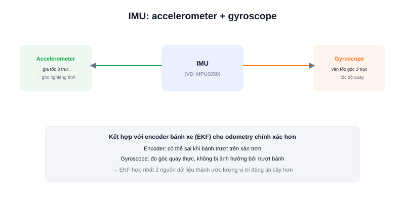

Bánh xe robot có thể trượt trên sàn trơn, encoder có thể đếm sai khi va chạm nhẹ — chỉ dựa vào dữ liệu bánh xe để biết robot đang "nghiêng" hay "quay" bao nhiêu là không đủ tin cậy. **IMU (Inertial Measurement Unit)** giải quyết vấn đề này bằng cách đo trực tiếp chuyển động của chính thân robot, độc lập với bánh xe.



## IMU gồm những gì

Một IMU cơ bản (loại phổ biến trong robot DIY) kết hợp hai cảm biến trong cùng một chip:

- **Accelerometer (gia tốc kế)** — đo gia tốc theo 3 trục X/Y/Z, dùng để ước lượng góc nghiêng tĩnh (dựa vào hướng trọng lực) và phát hiện va chạm/rung động đột ngột.
- **Gyroscope (con quay hồi chuyển)** — đo vận tốc góc quay quanh 3 trục, cho biết robot đang quay nhanh/chậm thế nào tại từng thời điểm, độc lập hoàn toàn với việc bánh xe có trượt hay không.

Một số IMU cao cấp hơn có thêm **magnetometer (la bàn số)** đo từ trường Trái Đất để xác định hướng tuyệt đối (Bắc/Nam) — bộ 3 cảm biến này gọi là IMU 9 trục (9-DOF), so với loại 6 trục chỉ có accelerometer + gyroscope.

### Vì sao AMR cần IMU

Encoder trên bánh xe tính được quãng đường đi bằng cách đếm vòng quay — nhưng nếu bánh trượt (sàn trơn, tăng tốc đột ngột), số đếm này sai lệch so với quãng đường thực. Dữ liệu góc quay từ gyroscope không bị ảnh hưởng bởi hiện tượng trượt bánh, nên thường được **kết hợp** với encoder (qua bộ lọc như Extended Kalman Filter) để cho ra ước lượng vị trí robot (odometry) chính xác hơn nhiều so với chỉ dùng riêng encoder.

## Dữ liệu IMU trong ROS2

IMU xuất dữ liệu theo chuẩn `sensor_msgs/Imu`, gồm 3 phần: gia tốc góc (angular velocity), gia tốc tuyến tính (linear acceleration), và hướng (orientation, nếu IMU tự tính sẵn qua bộ lọc nội bộ).

```text
sensor_msgs/Imu
  orientation                  # hướng dạng quaternion (nếu có)
  angular_velocity             # vận tốc góc quanh X/Y/Z (rad/s)
  linear_acceleration          # gia tốc tuyến tính theo X/Y/Z (m/s²)
```

## Kết luận

IMU là cảm biến nền tảng cho việc giữ định hướng và cải thiện độ chính xác odometry của AMR — hai bài tiếp theo trong chuyên mục này đi sâu vào từng thành phần: accelerometer và gyroscope.
