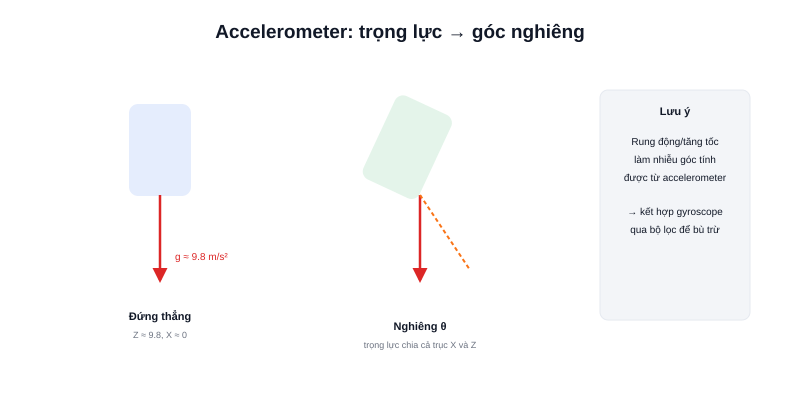

**Accelerometer (gia tốc kế)** là một trong hai cảm biến chính bên trong IMU, đo gia tốc theo 3 trục X, Y, Z. Nghe có vẻ trừu tượng, nhưng ứng dụng phổ biến nhất trong robot lại rất trực quan: dùng trọng lực để biết robot đang nghiêng bao nhiêu độ.



## Nguyên lý: trọng lực cũng là một gia tốc

Ngay cả khi đứng yên hoàn toàn, accelerometer vẫn đo được giá trị khoảng 9.8 m/s² (1g) theo trục thẳng đứng — đó chính là gia tốc trọng trường. Khi robot nghiêng, thành phần trọng lực này "chia" ra giữa các trục theo tỷ lệ phụ thuộc góc nghiêng, cho phép tính ngược lại góc nghiêng bằng lượng giác:

```text
Khi đứng thẳng:  trục Z ≈ 9.8 m/s²,  trục X, Y ≈ 0
Khi nghiêng θ:   trọng lực chia ra cả trục Z và trục nghiêng theo cos(θ)/sin(θ)

góc nghiêng ≈ atan2(gia_toc_X, gia_toc_Z)
```

## Điểm yếu: nhạy với rung động

Cách tính góc nghiêng ở trên chỉ chính xác khi robot **đứng yên hoặc di chuyển đều** — nguyên lý dựa vào giả định gia tốc đo được chỉ đến từ trọng lực. Khi robot tăng/giảm tốc, rung động do mặt sàn gồ ghề, hay va chạm nhẹ, accelerometer đo luôn cả gia tốc chuyển động thật lẫn trọng lực lẫn vào nhau — khiến góc nghiêng tính ra bị nhiễu, dao động liên tục dù robot không hề nghiêng thêm.

Đây là lý do accelerometer hiếm khi dùng một mình để tính góc nghiêng trong thực tế — thường kết hợp với gyroscope (đo vận tốc góc, không bị ảnh hưởng bởi rung động tuyến tính) qua bộ lọc như **Complementary Filter** hoặc **Kalman Filter** để lấy ưu điểm của cả hai: gyroscope chính xác tức thời nhưng trôi dần theo thời gian (drift), accelerometer không bị trôi nhưng nhiễu khi rung — kết hợp lại triệt tiêu nhược điểm của nhau.

## Đọc dữ liệu accelerometer (ví dụ MPU6050 qua Arduino)

```cpp
#include <Wire.h>
#include <MPU6050.h>

MPU6050 mpu;

void setup() {
  Wire.begin();
  mpu.initialize();
}

void loop() {
  int16_t ax, ay, az;
  mpu.getAcceleration(&ax, &ay, &az);   // đơn vị thô, cần chia theo độ nhạy cảm biến
}
```

## Kết luận

Accelerometer cho biết hướng trọng lực, từ đó suy ra góc nghiêng — nhưng chỉ đáng tin khi robot đứng yên hoặc chuyển động rất đều. Bài tiếp theo về gyroscope sẽ giải thích cảm biến bù trừ cho nhược điểm này.
