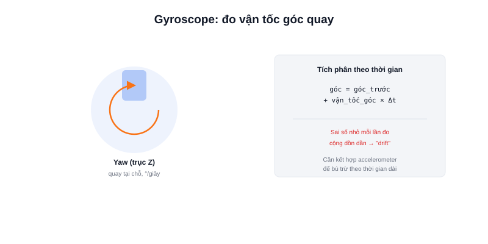

Nếu accelerometer trả lời câu hỏi "robot đang nghiêng bao nhiêu", thì **gyroscope (con quay hồi chuyển)** trả lời câu hỏi khác: "robot đang **quay nhanh cỡ nào**, quanh trục nào" — bằng cách đo trực tiếp vận tốc góc, không cần suy luận qua trọng lực như accelerometer.



## Vận tốc góc là gì

Gyroscope đo tốc độ thay đổi góc theo thời gian (đơn vị độ/giây hoặc radian/giây) quanh cả 3 trục X, Y, Z. Ví dụ robot quay tại chỗ 90° trong 1 giây thì gyroscope trên trục thẳng đứng (thường là trục Z, gọi là **yaw**) đo được vận tốc góc khoảng 90°/giây.

Muốn biết robot đã quay tổng cộng bao nhiêu độ (không phải đang quay nhanh cỡ nào), cần **tích phân** vận tốc góc theo thời gian:

```text
góc_hiện_tại = góc_trước + vận_tốc_góc × Δt
```

## Ưu điểm: không bị ảnh hưởng bởi trượt bánh

Đây là lý do gyroscope đặc biệt hữu ích cho odometry robot: nó đo **chuyển động quay thực của thân robot**, hoàn toàn độc lập với việc bánh xe có tiếp xúc tốt với mặt sàn hay không. Encoder bánh xe có thể đếm sai khi bánh trượt trên sàn trơn hoặc va chạm vật cản, nhưng gyroscope vẫn phản ánh đúng robot đang quay bao nhiêu.

## Nhược điểm: trôi dần theo thời gian (drift)

Vì phải tích phân liên tục để ra góc quay tổng, một sai số đo rất nhỏ ở mỗi lần đo (do nhiễu cảm biến) sẽ **cộng dồn dần theo thời gian** — sau vài phút, góc tính được có thể lệch đáng kể so với thực tế dù robot đứng yên hoàn toàn. Hiện tượng này gọi là **drift**, là nhược điểm cố hữu của mọi gyroscope giá rẻ (MEMS).

Đây là lý do gyroscope hiếm khi dùng một mình trong thời gian dài — thường kết hợp với accelerometer (không bị trôi nhưng nhiễu khi rung, xem bài trước) hoặc magnetometer qua bộ lọc Complementary/Kalman, hoặc định kỳ "sửa lại" bằng dữ liệu từ nguồn khác như LiDAR/camera trong SLAM.

## Kết luận

Gyroscope cho dữ liệu quay chính xác tức thời và không sợ trượt bánh, nhưng tự nó sẽ trôi dần nếu dùng một mình trong thời gian dài. Kết hợp cùng accelerometer là cách phổ biến nhất để cả hai bù trừ nhược điểm cho nhau — nền tảng của hầu hết thuật toán ước lượng hướng (orientation) trong robot.
