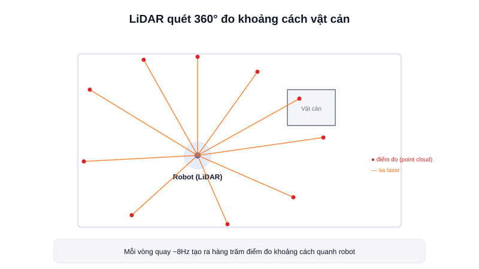

Một robot di động (AMR) muốn tự né tường, né người, và tự dựng bản đồ nhà xưởng thì trước hết phải "nhìn thấy" khoảng cách đến mọi vật xung quanh nó. **LiDAR** (Light Detection and Ranging) là cảm biến phổ biến nhất để làm việc này — đo khoảng cách bằng cách bắn tia laser rồi tính thời gian ánh sáng phản xạ về.



## Nguyên lý hoạt động

Phần lớn LiDAR giá rẻ dùng cho robot (YDLIDAR, RPLiDAR...) đo khoảng cách theo nguyên lý **tam giác đạc quang học (triangulation)**: một tia laser chiếu ra vật cản, ánh sáng phản xạ về được thu bởi một cảm biến ảnh nằm lệch một góc so với tia phát — từ góc lệch này, tính ra được khoảng cách bằng hình học tam giác. LiDAR công nghiệp/ô tô tự lái thường dùng nguyên lý khác là **Time-of-Flight (ToF)**: đo trực tiếp thời gian ánh sáng đi và về, cho tầm quét xa hơn nhưng giá cao hơn nhiều.

Một mô-tơ bên trong LiDAR quay đầu phát/thu liên tục 360°, mỗi vòng quay tạo ra hàng trăm điểm đo (VD: ~500 điểm/vòng ở tần số quét ~8Hz) — tập hợp các điểm này gọi là **point cloud** (với LiDAR 2D thì gọi là **laser scan**, một mặt phẳng điểm).

### Vì sao AMR cần LiDAR thay vì chỉ dùng camera

- Đo khoảng cách trực tiếp bằng mét/centimet — không cần tính toán suy luận độ sâu như camera đơn.
- Không phụ thuộc ánh sáng môi trường — hoạt động tốt cả trong bóng tối.
- Dữ liệu point cloud/laser scan đã sẵn sàng cho các thuật toán SLAM và Nav2 tiêu chuẩn của ROS2, không cần xử lý ảnh phức tạp.

## Dữ liệu LiDAR trong ROS2

LiDAR 2D xuất dữ liệu theo chuẩn `sensor_msgs/LaserScan` — một mảng khoảng cách theo từng góc quét, đủ để `slam_toolbox`/Cartographer dựng bản đồ và Nav2 né vật cản ngay khi cắm vào, không cần viết driver riêng.

```text
sensor_msgs/LaserScan
  angle_min, angle_max     # góc quét bắt đầu/kết thúc (radian)
  angle_increment          # góc giữa 2 điểm đo liên tiếp
  ranges[]                 # mảng khoảng cách đo được (mét) theo từng góc
```

## Kết luận

LiDAR là "đôi mắt đo khoảng cách" gần như bắt buộc cho một AMR tự hành trong nhà — cho dữ liệu trực tiếp, đáng tin cậy, và tương thích sẵn với hệ sinh thái SLAM/Nav2 của ROS2. Bài tiếp theo trong chuyên mục này so sánh LiDAR 2D và 3D để biết khi nào cần loại nào.
