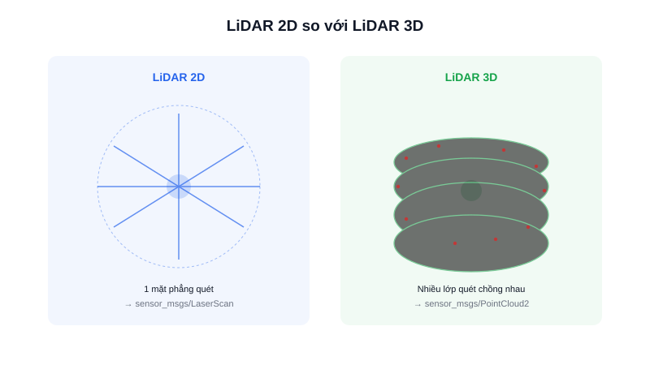

Phần lớn AMR chạy trong nhà chỉ cần LiDAR **2D** — rẻ, đủ dữ liệu cho SLAM và Nav2. Nhưng một số ứng dụng (robot ngoài trời, môi trường nhiều tầng vật cản ở các độ cao khác nhau) lại cần LiDAR **3D**. Bài này so sánh trực tiếp để biết khi nào nên chọn loại nào.

## Khác biệt nguyên lý

LiDAR **2D** chỉ có một tia laser quét quanh một mặt phẳng cố định (thường ngang tầm robot) — dữ liệu ra là một lát cắt khoảng cách theo 360°, đúng kiểu `sensor_msgs/LaserScan`. LiDAR **3D** có nhiều tia laser xếp chồng theo phương thẳng đứng (VD: 16, 32, 64 kênh) cùng quay, mỗi kênh quét một mặt phẳng hơi lệch góc nhau — kết quả là một **point cloud** 3 chiều đầy đủ, biểu diễn bằng `sensor_msgs/PointCloud2`.

## Bảng so sánh

| Tiêu chí | LiDAR 2D | LiDAR 3D |
|---|---|---|
| Dữ liệu ra | 1 lát cắt (LaserScan) | Point cloud 3D (PointCloud2) |
| Phát hiện vật cản | Chỉ ở đúng độ cao gắn cảm biến | Phát hiện vật ở nhiều độ cao |
| Khối lượng dữ liệu | Nhỏ, xử lý nhẹ | Lớn hơn nhiều lần, cần máy tính mạnh hơn |
| Chi phí | Thấp (vài trăm nghìn – vài triệu đồng) | Cao (nhiều triệu đến hàng chục triệu) |
| SLAM/Nav2 | Dùng thẳng với slam_toolbox, Cartographer, Nav2 | Cần thêm bước "cắt lớp" point cloud thành dạng 2D hoặc dùng thuật toán SLAM 3D riêng |

## Khi nào cần lên 3D

LiDAR 2D có một điểm mù quan trọng: chỉ "nhìn thấy" vật cản đúng ở độ cao nó được gắn — một cái bàn thấp hoặc vật nhô ra ở độ cao khác sẽ không được phát hiện. LiDAR 3D giải quyết vấn đề này bằng cách quét nhiều lớp, nhưng đổi lại tốn nhiều tài nguyên tính toán hơn hẳn.

Trong thực tế, đa số AMR trong nhà (kho, nhà xưởng, phòng thí nghiệm) vẫn dùng LiDAR 2D là đủ — bù lại điểm mù độ cao bằng cách gắn thêm cảm biến siêu âm/ToF tầm thấp hoặc camera độ sâu ở các độ cao khác. Chỉ nên đầu tư LiDAR 3D khi môi trường vận hành thực sự có nhiều vật cản ở độ cao khác nhau mà cách bù trên không đủ (VD: robot ngoài trời, kho có kệ hàng nhô ra không đều).

## Kết luận

LiDAR 2D là lựa chọn mặc định hợp lý cho hầu hết AMR trong nhà nhờ chi phí thấp và tương thích sẵn với hệ sinh thái SLAM/Nav2 chuẩn. LiDAR 3D chỉ cần thiết khi bài toán thực sự đòi hỏi nhận diện vật cản ở nhiều độ cao — không nên chọn 3D chỉ vì "nghe có vẻ xịn hơn".
